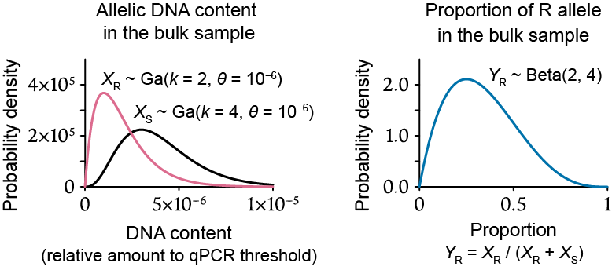
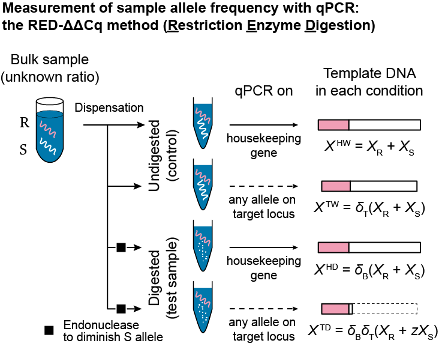
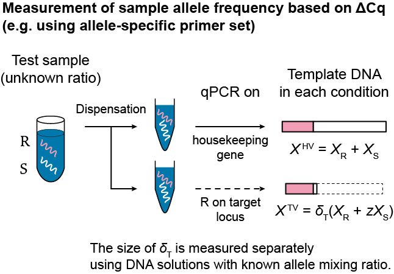

# freqpcr

R package author: Masaaki Sudo (https://orcid.org/0000-0001-9834-9857)

複数個体から一括で抽出された DNA サンプル（バルク DNA サンプル）に対する定量 PCR 分析の ΔΔCq 値に基づき、個体群のアリル（対立遺伝子）頻度を区間推定する。

* [(Github) Releases and PDF help](https://github.com/sudoms/freqpcr/releases/latest)
* [Paper: Sudo and Osakabe (2021) Molecular Ecology Resources. doi:10.1111/1755-0998.13554 (Open Access)]( https://doi.org/10.1111/1755-0998.13554)
* [(Preprint)](https://doi.org/10.1101/2021.01.19.427228)
* [README in English](https://github.com/sudoms/freqpcr/README.md)

しばらく freqpcr の原理説明なので、とりあえず動かしてみたい人は **[インストール](#インストール)** へ進んでください。

# 特徴

ΔΔCq 法に準拠した定量 PCR 分析に基づき、個体群アリル頻度（population allele frequency）を区間推定する R パッケージ。

* 動物や植物の特定の遺伝子座について、問題とする特定のアリル（対立遺伝子）がそれ以外のアリルに対して、個体群レベルでどの程度の割合で存在しているかを知りたい。
* 対象の個体群について、複数の個体を一括して抽出された DNA サンプル（バルク DNA サンプル）が複数得られている。
* 各バルクサンプルについてリアルタイム PCR に基づく定量 PCR 分析が行われ、Cq 値の組が利用可能である。
* バルクサンプルごとに、Cq 値の組を用いて計算された ΔΔCq 値が、そのバルクサンプルにおけるアリル頻度の指標となるような PCR 分析手法（ΔΔCq 法）が用いられている。

上記の要件で、各バルクサンプルに何個体分の DNA が含まれているか（N）と、各バルクサンプルについて測定された Cq 値の組（ΔΔCq 法なので 4 つずつある※）を入力データに取り、個体群レベルのアリル頻度の最尤推定値、およびその漸近信頼区間を推定するツール（`freqpcr()` 関数）を提供する。

推定に先立ってリアルタイム PCR 時の増幅効率などの、補助的パラメータが必要である。検出対象アリルを持つ個体と、それ以外のアリルを持つ個体に由来する DNA 抽出物を、既知頻度で混合したサンプル溶液を使って、補助的な実験パラメータを事前に推定しておく関数（`knownqpcr()` および `knownqpcr_unpaired()` 関数）も含まれている。

> ※バージョン 0.4.0 以降では 2 つの Cq 測定値の組（ΔCq 法）でも動作するようになった。


# 動作原理

## 複数個体の混合 DNA 溶液に含まれるアリル存在比のモデル化

前提として、ターゲットとする遺伝子座について未知頻度 p : (1 - p) で 2 種類のアリルを含む個体群から、複数の個体をランダムサンプリングしたとする。なお「2 種類のアリル」は「検出対象とそれ以外の全種類」でもいい。PCR 分析に用いるプライマーは、検出対象のアリルを特異的に増幅するか、あるいは後述する制限酵素処理により、検出対象のアリル以外が分解されるように設計しておく。

たとえばフェロモンを誘引源としたトラップで、n 個体の害虫（ただし単数体を仮定している）を採集し、うち m 個体が薬剤抵抗性遺伝子（R アリル）を、残り n - m 個体が感受性遺伝子（S アリル）を持つ状況を考える（Figure 1）。このサンプリング過程は二項分布 m \~ Bin(n, p) で表される。

<p align="center">

</p>

> Figure 1. バルクサンプルの生成過程。未知頻度 p : (1 - p) で 2 種類のアリル、たとえば R（薬剤抵抗性）と S（感受性）を含む個体群を対象に、トラップを仕掛けて個体を採集する。あるトラップで n 個体が得られたとき、これに含まれる R 個体の数は m ~ Bin(n, p) という確率変数で表現される。個体単位ではなくトラップ単位で DNA を一括抽出して定量 PCR 分析を行うと、個体の分離比 m : (n - m) ではなく、バルクサンプルにおけるアリル DNA の含有量である X_R, X_S がデータとして観測される。そこで freqpcr では p と X_R, X_S の関係を、m を潜在変数として介しつつモデル化する。

仮に個体別に遺伝子診断すれば m の値が直接求まるため、頻度 p の推定値や信頼区間を二項分布から計算できる。これが労力的に可能ならば、定量 PCR 分析を行って `freqpcr` を使う必要は特段ない。
しかし p が極めて小さいことが想定される場合、たとえば殺虫剤抵抗性の発達初期段階における R アリルの検出や、穀物の輸入検疫における遺伝子組換え種子の混入率調査などでは、十分に大きな採集数 n を確保しないと、サンプルに全く検出対象のアリルが含まれない（有効な推定値が得られない）可能性が高くなる。必要なサンプルサイズが数百に及ぶ場合、個体別に DNA を抽出して PCR で遺伝子診断を行う手間が増大する。

多数のサンプルから簡易に低頻度のアリルを検出するために、グループテスト（group testing）と呼ばれる統計手法が従来から用いられてきた。まず複数個体から一括で DNA を抽出して、バルクサンプル（bulk sample）と呼ばれるサンプル溶液を作る。通常のグループテストでは、検出対象のアリルを増幅する PCR 反応を行い、各バルクサンプルに少なくとも 1 個体は検出対象が含まれている（陽性）か、全く含まれず PCR 増幅されない（陰性）かを判定した結果を用いる。複数のバルクサンプルについて陽性／陰性である割合を求め、アリル頻度 p の信頼区間の上限を計算する統計手法が、幾つかの先行研究において提唱されている（たとえば Yamamura and Hino 2007）。

一方 `freqpcr` では、各バルクサンプルについて定量 PCR 分析を行い、アリルごとに含まれる DNA 量（Figure 1：変数 X_R, X_S）を定量する。アリル DNA 含有比の指標として、従来より定量 PCR 分析で用いられてきた ΔΔCq 値の概念を用い、それらのバルクサンプルが由来する個体群のアリル頻度の推定値、および信頼区間の上限と下限を最尤推定する。個体群アリル頻度が p であるときに Cq 値の観測結果を得る確率が、生成モデルとして書き下され、このときバルクサンプルごとに含まれるであろう陽性個体の数（m）は、直接観測できない潜在変数として扱われる。


### 個体あたり DNA 収量のばらつき：ガンマ分布およびベータ分布による近似


体サイズの変異や（トラップ上での）死後の DNA 分解といった要因により、バルクサンプルに含まれる個体あたりの DNA 収量は大きくばらつくことがある。`freqpcr` では、バルクサンプルに含まれる陽性個体数の不確実性（二項分布に従う）に加え、バルクサンプルに含まれるアリルごとの DNA 収量（Figure 1 および 2：変数 X_R, X_S）の不確実性を、ガンマ分布という確率分布で近似する手法を採用した。このアイデアについては [Sudo et al. (2021) Journal of Pesticide Science](https://www.jstage.jst.go.jp/article/jpestics/46/2/46_D20-064/_article/-char/en) に詳しい。

ガンマ分布は形状パラメータの設定次第で、生物遺体等において DNA がランダムに分解しており、個体あたり収量が大きくばらつく場合（指数分布）から、生体において DNA 収量が平均値の周りにほぼ正規分布する場合までを、統一的にモデルで表現できる。本パッケージに含まれる `freqpcr()` 関数を用いれば、ガンマ分布の形状パラメータ（k）もアリル頻度 p と同時に推定される。ユーザーは個体ごとの DNA 量のばらつき度合いを知らなくても、アリル頻度の頑健な推定値を得られる。

ガンマ分布が持つ好ましい性質の 1 つが「再生性」である。あるアリルに着目して、各個体が持つ DNA 量が独立にガンマ分布（等しい尺度パラメータを持つ）に従うならば、複数個体まとめたバルクサンプルに含まれる当該アリルの DNA 量もまた、単一のガンマ分布に従う（Figure 2 左）。


<p align="center">

</p>

> Figure 2.（左）バルクサンプルに含まれる R ないし S アリルの量は、1 個体 1 遺伝子座あたりの DNA 収量を、各アリルを持つ個体数分だけ足し合わせた量になる。図は単数体生物 6 個体から DNA 抽出したバルクサンプルにおいて、2 個体が R と仮定した場合である。個体あたりの DNA 収量がガンマ分布 Ga(k = 1, θ = 10^(-6)) に従う確率変数ならば、2 個体分に相当する R アリルの量は Ga(k = 2, θ = 10^(-6)) で表される。一方、4 個体分に相当する S アリルの量は Ga(k = 4, θ = 10^(-6)) に従う。（右）このときバルクサンプルに占める R アリルの割合、すなわち Y_R = X_R / (X_R + X_S) に相当する量は、ベータ分布 Beta(shape1 = 2, shape2 = 4) に従う。


さらにガンマ分布の性質から、バルクサンプル中に含まれる 2 種類のアリル量の比は、ベータ分布という確率分布に従う（Figure 2 右）。`freqpcr()` 関数の標準設定では 2 つのガンマ分布の代わりに、1 つのベータ分布を利用してアリルの含有比を表現する。これは推定の高速化（数秒以内に計算が完了する）に寄与する。

なお Figure 2 に示した DNA 収量（X_R, X_S）やアリル含有比（Y_R）は、各遺伝子型に該当する個体数 m が固定されたときの値であることに注意を要する。実際には m も確率変数なので m = (1, 2, ..., n-1) のそれぞれについて、Beta(m, n - m) の下で実際の Cq 値が観測される確率を求め、尤度関数を定義するのが `freqpcr` の仕様である。以下、Cq 値の組がどのような実験デザインで得られるかを述べてゆく。


---

## 定量 PCR 分析を用いたアリル頻度推定の原理：ΔΔCq 法と RED-ΔΔCq 法

1 つ 1 つのバルクサンプルに含まれる 2 種類のアリルの含有比、すなわちサンプルアリル頻度（sample allele frequency）を測定する実験手法として、現在の `freqpcr` パッケージでは

* RED-ΔΔCq 法：制限酵素によるサンプル前処理を伴う定量 PCR（Osakabe et al. 2017）
* アリル特異的なプライマーセットを用いた定量 PCR による ΔΔCq 法（Maeoka et al. 2020）

の 2 種類の定量 PCR 分析手法（Figures 3, 4）が公式にサポートされている。その他の ΔΔCq や ΔCq に準拠した分析プロトコルでも適用可能なものは多いと思われるので、共同研究のオファーがあれば歓迎する。


### RED-ΔΔCq 法


RED-ΔΔCq 法（ΔΔCq Method with Restriction Enzyme Digestion）では、ターゲット遺伝子座について未知頻度でアリルが混合されている DNA 溶液から、4 本のサンプルを分注する。異なる処理条件・プライマーセットでリアルタイム PCR を行い、ΔΔCq を計算して当該溶液のアリル混合比を求める（Figure 3）。Cq 値や ΔΔCq 値の定義自体は、一般的なリアルタイム PCR のそれら（e.g. Livak & Schmittgen 2001; Vandesompele et al. 2002）と同様である。

RED-ΔΔCq 法の PCR ではターゲット遺伝子座を、アリルとは無関係に増幅するプライマーセットが用いられる。よって DNA 抽出して得たバルクサンプル溶液をそのまま PCR に掛けるならば、(X_R + X_S) の和に相当する量の鋳型 DNA が含まれる。これが control sample である。

一方、分注した溶液の半分については PCR の前に制限酵素で処理し、ターゲット遺伝子座において片方のアリルだけを消去しておく。こちらが digested test sample である。S アリルのごく一部（z）だけが残るように制限酵素で切断すると、ターゲット遺伝子の鋳型量は (X_R + zX_S) 相当となる。従って digested test sample と control sample の鋳型量の商である (X_R + zX_S) / (X_R + X_S) が、z が小さければ R アリルのおよその存在頻度となる。


> 注：制限酵素で切断するアリルは R でも S でもよい。ただし推定精度を上げるためには、個体群において稀であると考えられるアリルを残す（多い方を分解する）とよい。たとえば地域に稀に存在する抵抗性を検出したければ、感受性遺伝子を制限酵素処理する。そのほうが実験処理間で Cq 値に大きな差が現れるようになり、定量 PCR の測定誤差にマスクされにくくなる。

たとえば Osakabe et al. (2017) は、ナミハダニの殺ダニ剤（エトキサゾール）抵抗性遺伝子を定量するために、サンプル溶液を 3 時間、Taq1 酵素で事前処理した。Taq1 は DNA 上の TCGA という塩基配列がある箇所を認識して切断する。エトキサゾール抵抗性はキチン合成酵素遺伝子（CHS1）の塩基配列 TCG ***A*** TT が TCG ***T*** TT に変異して生じるので、酵素処理するとターゲット遺伝子座について、感受性個体由来の DNA が切断されたサンプルを得る。

<p align="center">

</p>

> Figure 3. 定量 PCR 分析に基づくバルクサンプル中のアリル含有比の測定 (1) RED-ΔΔCq 法。異なる事前処理（制限酵素処理）を受けたサンプル間で鋳型 DNA 量を比較するための補正基準として、生物体内に一定量が存在する遺伝子（ハウスキーピング遺伝子）を対象とした PCR 増幅を並行して実施している。
> 
> ターゲットの遺伝子座についてもハウスキーピング遺伝子座についても、プライマーセットはアリルを問わずに増幅するものを用いる。ただし制限酵素処理を受けたサンプルでは、ターゲット遺伝子座に S アリルを持つ DNA 分子のみ、サイトが途中で切断されているため増幅対象から外れる。この鋳型 DNA 量の違いが R アリルの頻度、厳密には (X_R + zX_S) / (X_R + X_S) = Y_R + z(1−Y_R) として測定される。
> 
> この (X_R + zX_S) / (X_R + X_S) という値は図中で (X^TD / X^HD) として計算される Cq 値の差分に含まれるが、余計な係数 δ_T が入っている。これは (X^TD / X^HD) / (X^TW / X^HW) という指標を計算することでキャンセルされる。これを対数スケール（PCR のサイクル数）で表現すると Cq 値の「差分の差分」となり、すなわち ΔΔCq 値に他ならない。

ただし、digested test sample と control sample をそれぞれターゲット遺伝子について増幅した結果を、単純に割り算するだけ（Figure 3 の鋳型量でいうと (X^TD / X^TW) に相当する量）では上手く行かない。制限酵素処理に伴って、溶液の量や性質が不随意に変化しうるためだ（Figure 3 で係数 δ_B として表されている量である）。

そこで内部標準、典型的にはハウスキーピング遺伝子（Osakabe et al. 2017 では GAPDH）について増幅した結果（X^HD と X^HW に相当）を用いて、先に各サンプルの鋳型量を補正しておく。鋳型 DNA 量の比は Cq 値（サイクル数。対数スケールである）の差として表現されるので、digested test sample と control sample の各々について、(ターゲット遺伝子の Cq 値)−(ハウスキーピング遺伝子の Cq 値) を計算する。こうした Cq 値の差分（digested test sample では X^TD / X^HD、control sample では X^TW / X^HW に相当する量）のことを ΔCq という。

同じ処理を受けたサンプルでも、生体内での DNA コピー数は遺伝子座によって異なるかもしれない。それぞれ求めた ΔCq 値には、この差が係数 δ_T として残っている。余分な係数を含まない (X_R + zX_S) / (X_R + X_S) に相当する量を得るには、制限酵素あり・なしの条件間で ΔCq 値同士の差分を取ればよい。こうして得られる ΔΔCq 値すなわち (X^TD / X^HD) / (X^TW / X^HW) では、δ_B も δ_T もキャンセルされる。よって RED-ΔΔCq 法は検量線を必要とせず、検査対象である未知溶液のアリル含有比を測定できる。

なお (X_R + zX_S) / (X_R + X_S) は、z が未知な場合はバルクサンプル中のアリル頻度 Y_R = X_R / (X_R + X_S) そのものではなく、近似値である。そこで Osakabe et al. (2017) では、制限酵素処理を長時間行って z を極力小さくすることを推奨した。一方 `freqpcr()` を用いてアリル頻度を推定する場合、z のサイズが多少大きくても既知でさえあれば推定が可能である。むしろ z が小さすぎる（10^{-5} 以下）と、サンプルに R アリルが含まれていない際に「制限酵素処理あり、ターゲット遺伝子」の qPCR に要するサイクルが長すぎて、反応が立ち上がってこない恐れがある。 

### アリル特異的プライマーセットを用いた ΔΔCq 法

Osakabe et al. (2017) の RED-ΔΔCq 法を適用するには、ターゲット遺伝子座について片方のアリルに作用する制限酵素を見つけることが要件である。この制約を取り除くため Maeoka et al. (2020) において、アリル特異的なプライマーセットを用いた ΔΔCq 法による、アリル頻度の測定手法が提案された（Figure 4）。

<p align="center">

</p>

> Figure 4. 定量 PCR 分析に基づくバルクサンプル中のアリル含有比の測定：(2) アリル特異的プライマーセットを用いた ΔΔCq 法（Maeoka et al. 2020）。
> 
> こちらも (X^TD / X^HD) / (X^TW / X^HW) = Y_R + z(1 − Y_R) で抵抗性アリル頻度を近似する。ただし RED-ΔΔCq 法と異なり、テストサンプルと control sample では由来がそもそも異なるため δ_B は定義せず、代わりに control sample の鋳型 DNA 量を X'_R として記号自体を変えている。


アリル含有比が不明な test sample（制限酵素処理は不要である）の DNA 溶液から、2 本ほど分注してターゲット遺伝子とハウスキーピング遺伝子でリアルタイム PCR 増幅し、Cq 値を測定する。ただし今度は、ターゲット遺伝子を増幅するためのプライマーを、R アリルだけ特異的に増幅するように設計しておく。従ってハウスキーピング遺伝子では X^HD = (X_R + X_S) に相当する量が増幅対象だが、ターゲット遺伝子では X^TD = δ_T(X_R + zX_S) が増幅される。本法における z は、僅かに生じる非特異的な増幅の対象となる S アリルの割合である。

(X^TD / X^HD) には遺伝子座の間での鋳型 DNA 量の比、すなわち δ_T が未だ係数として掛かったままである。これを RED-ΔΔCq 法と同様、control sample を用いてキャンセルする。
アリル特異的プライマーセットを用いた ΔΔCq 法では、RED-ΔΔCq 法で用いられたコントロール、すなわち制限酵素処理を伴わないサンプル溶液自体の代わりに、確実に R と分かっている個体からの DNA 抽出液を control sample に用いる。典型的には、室内飼育で選抜した純系の R 個体を使う。

Control sample において、ハウスキーピング遺伝子では X^HW = X'_R 、ターゲット遺伝子では X^TW = δ_T X'_R が増幅される（反応液の由来が異なるので X ではなく X' としている）。つまり ΔCq 値を計算すれば、そのまま δ_T に相当する量が求められる。最終的に ΔΔCq の形に持ち込むことで、 (X^TD / X^HD) / (X^TW / X^HW) = (X_R + zX_S) / (X_R + X_S) に相当する量を得る。

### ΔCq 法によるアリル頻度の推定

なお δ_T のサイズが既知であれば、test sample だけをターゲット遺伝子とハウスキーピング遺伝子で増幅して X^TD と X^HD を得てから、δ_T に相当する量を差し引くことでもアリル頻度を推定できる。つまり ΔCq 法である。バージョン 0.4.0 において、X^TW と X^HW を欠いたデータセットも受け入れられる仕様に `freqpcr()` 関数が拡張された。

この場合 δ_T（引数 `targetScale`）および、測定された Cq 値が従う正規誤差の標準偏差 σ_c（`sdMeasure`）は、事前に既知頻度のサンプル溶液で推定しておく。下のセクションにある `knownqpcr()` もしくは `knownqpcr_unpaired()` 関数が使える。バルクサンプルの個数が極めて多ければ、未知数として `freqpcr()` 関数内部で推定することは不可能ではないが、よほどの理由がない限り固定値として代入すべきである。ただでさえ X^TW、 X^HW が無いことは推定時のデータ点が半分になることを意味しており、未知パラメータが多いと推定結果に大きなバイアスが生じる。

<p align="center">

</p>


> Figure 5. 定量 PCR 分析に基づくバルクサンプル中のアリル含有比の測定：(3) ΔCq 法。


## 複数バルクサンプルを用いたアリル頻度の区間推定

Osakabe et al. (2017) と Maeoka et al. (2020) の各論文では、各バルクサンプルに様々な条件でリアルタイム PCR を行い、計算した ΔΔCq 値を、そのバルクサンプルに占める当該アリルの含有比（点推定値）としている。一方 `freqpcr` パッケージは Cq 値に基づく個体群アリル頻度の区間推定を目指しているが、そのためには 1 個体群から取られたバルクサンプルが複数（N）必要である。

一箇所にトラップを複数設置して、トラップごとに DNA 抽出したものを 1 つのバルクサンプルとしてもよいし、あるいは多数の捕獲個体を n 個体ずつまとめて DNA 抽出してもよい。`freqpcr` ではバルクサンプルごとに個体数 n_h  (h = 1, 2, ..., N) が異なってもよいが、各バルクサンプルに何個体含まれるかの記録は必須である。

捕獲した総個体数が等しければ、サンプルを多く分割する（バルクサンプルあたりの個体数を少なくする）ほど信頼区間の幅は狭くなり、高い推定精度を得られる。しかし定量 PCR の検査数が増えるのでコストは増大する。バルクサンプルの分割数に応じた推定精度のシミュレーション結果は、[原著論文の Figure 4](https://onlinelibrary.wiley.com/doi/10.1111/1755-0998.13554#men13554-sec-0015-title) および [ESM1](https://onlinelibrary.wiley.com/doi/10.1111/1755-0998.13554#support-information-section) に示されている。

---

## 2 倍体の取扱いについて

`freqpcr` のモデル構造は、基本的には単数体生物を仮定している。すなわち各個体を構成する各細胞が 1 本の染色体を持ち、1 つのアリル DNA を含む。アリル頻度推定を行う `freqpcr()` 関数は `diploid` というオプション変数を持ち、初期設定は `diploid = FALSE` すなわち単数体であるとして、各個体の DNA 量をモデリングする。

通常の昆虫や脊椎動物は 2倍体、すなわち各細胞が 2 本の染色体を持つ。この場合、`diploid = TRUE` を設定して `freqpcr()` 関数を実行すれば、簡易的に 2 倍体生物を取り扱うことができる。

`freqpcr()` 関数では `N` という変数ベクトルを用いて、バルクサンプルを構成する個体の数を代入する。`diploid = TRUE` でも `diploid = FALSE` でも、`N` は染色体数ではなく個体数として代入する仕様である。たとえば `N = c(8, 8, 8, 6)` と代入すると、単数体であっても 2 倍体であっても合計 30 個体が採集され、これを 8 個体ずつ DNA 抽出したバルクサンプル溶液 3 本と、残る 6 個体を DNA 抽出した溶液 1 本という構成で分析されたことを意味する。

2 倍体生物における個体あたり DNA 収量のモデル表現を、現行の `freqpcr()` では簡略化していることに注意が必要である。詳細は元論文の Appendix S1 に記述されているが、端的にいうと同一個体が持つ 2 セットのアリルの定量が厳密ではない。

本来、2 倍体の 1 個体から得られるアリル DNA 量は、単数体当量のちょうど 2 倍である。とりわけヘテロ個体が持つ R アリルと S アリルの DNA 量は同一であるべきだが、この制約条件を置くとプログラムの計算量が著しく増大する。そこで「2 倍体生物を n 個体採集する」代わりに、「単数体生物を 2n 個体採集したことにする」トリックを用いた。これにより、同一個体から得られた 2 セット分のアリルの DNA 量が、それぞれのセットについて独立同時なガンマ分布に従うようになり、単数体と同じモデルを適用できる。本簡易推定法を用いることで、アリル頻度 p の最尤推定値（点推定値）には影響しないと考えられるが、信頼区間が本来の範囲よりも僅かに広く推定される。

---

## 連続な DNA 量を仮定した freqpcr モデルについて

（執筆中）


---


# 依存パッケージ

* R (>= 3.6)
* cubature (https://cran.r-project.org/package=cubature)

開発環境は Windows 10 上の R 3.6 だが、R 4.1.2 でも動作したとのこと。

# インストール

```R
install.packages("freqpcr", dependencies=TRUE)

library(freqpcr)
packageVersion("freqpcr")
```

もしくは

```R
library(remotes)
install_github("sudoms/freqpcr")

library(freqpcr)
packageVersion("freqpcr")
```

以下のようなエラーメッセージが出て、インストールに失敗することがある。

```R
** byte-compile and prepare package for lazy loading
Error: (converted from warning) package 'cubature' was built under R version 3.6.3
```

依存パッケージ 'cubature' が、[ユーザーの環境よりも新しいバージョンの R でコンパイルされている](https://github.com/r-lib/remotes/issues/403)場合に、このエラーが出る。
R のバージョンを素直に最新版にする、もしくは環境変数 `R_REMOTES_NO_ERRORS_FROM_WARNINGS="true"` を設定後、`install_github()` を再度走らせることで解消する。

```R
Sys.setenv(R_REMOTES_NO_ERRORS_FROM_WARNINGS="true")
install_github("sudoms/freqpcr")
```

# 使用法

```R
library(freqpcr)
```

## 変数・パラメータの一覧

P:
* 推定対象であるアリルの個体群に占める頻度

K:
* 対象個体群において、1 個体（単数体当量）あたりのアリル DNA 収量を近似するために用いられるガンマ分布の形状パラメータ

以下はリアルタイム PCR の実験系に依存するパラメータである。次に説明する `knownqpcr()` および `knownqpcr_unpaired()` 関数のいずれかを用いて、予め推定しておく。なお **太字** は `freqpcr()` の動作時にユーザーによる値の指定が必須のパラメータ、 ***太字かつ斜体*** は必須ではないが、可能な限り指定すべきパラメータである。特にバルクサンプルの数が少ない時に、`sdMeasure` を指定しないと推定結果が大きくずれる。


**EPCR**:
* PCR サイクルごとの増幅効率を表す正の実数。
* EPCR = 1 であるとき、鋳型 DNA が PCR 1 サイクルあたり 2 倍ずつ増える（リアルタイム PCR の慣習に従い、EPCR + 1 = 2 なので 2 倍と定義している）。

**zeroAmount**:

* （RED-ΔΔCq 法）ターゲットとする遺伝子座において、検出対象でない方のアリルを分解する制限酵素反応で、反応後もなお分解されなかったアリル DNA の残存率。

* （一般的な ΔΔCq 法において）アリル特異的な PCR プライマーセットを用いた PCR 反応で、極僅かに増幅されてしまう検出対象でない方のアリルの割合（検出対象アリルの鋳型量を 1 とした、鋳型値の相対値）。

* `freqpcr()` 関数の実行時には 0 以上 1 以下の実数として、ユーザーが指定する必要がある。

***sdMeasure***:

* 定量 PCR 分析における各 Cq (Ct) 値が従うランダム誤差（標準偏差の大きさ）。元論文で σ_c として表されている変数。リアルタイム PCR の実験誤差は Cq 値のスケールで概ね正規分布するようである（本研究の[原著論文の実験 1](https://onlinelibrary.wiley.com/doi/10.1111/1755-0998.13554#men13554-sec-0010-title) を参照せよ）。

***targetScale***:

* 同一サンプルから分注した等量の DNA 溶液において、ターゲットとする遺伝子座の DNA が（アリルに関係なく）、ハウスキーピング遺伝子の何倍存在するか。元論文で δ_T として表されている変数。

scaleDNA:

* 1 個体に含まれる（単数体当量の）ハウスキーピング遺伝子の平均的な DNA 量が、PCR 反応のスレッシュホールドに比べて何倍存在するか。PCR 1 サイクルでちょうど 2 倍に増える（`EPCR` = 1）ならば、`scaleDNA` = 0.5 のとき 1 サイクルの PCR でスレッシュホールドに達する。2^{10} = 1024 から類推できるように、`scaleDNA` = 10^{-6} であれば約 20 の Cq 値に相当する。
* なお `EPCR` が決まれば自ずと固定するため、`freqpcr()` 関数の引数には含まれない。

baseChange:

* RED-ΔΔCq 法において制限酵素処理を行う前後で、増幅可能なハウスキーピング遺伝子の鋳型量が何倍に変化するか（実験操作に伴う不随意な変化として）。元論文で δ_B として表されている変数。

* Maeoka et al. (2020) の方法や、その他のよくある ΔΔCq 法では、この変数は存在しない（※）。いずれの場合でも `freqpcr()` 関数の実行には不要であり、引数に含まれない（なぜ不要かというと、`freqpcr()` 関数は 4 つの Cq 値を 2 つの ΔCq に換算してから尤度関数に投入するためである。詳しくは[論文の数式 11](https://onlinelibrary.wiley.com/doi/10.1111/1755-0998.13554#men13554-disp-0014) を見てほしい）。


> ※これは、RED-ΔΔCq 法以外のあらゆる ΔΔCq 分析において baseChange が存在しないという意味ではない。制限酵素処理でなくても、実験水準間でハウスキーピング遺伝子の鋳型 DNA 量に、何らかの系統誤差を与えるような実験操作はあり得るので、そのような実験系の中には RED-ΔΔCq 法と同様の発想で `knownqpcr()` および `knownqpcr_unpaired()` 関数を使うべきものもあるだろう。


---


## knownqpcr() ないし knownqpcr_unpaired() 関数による実験パラメータの推定

[原著論文の実験 1](https://onlinelibrary.wiley.com/doi/10.1111/1755-0998.13554#men13554-sec-0010-title) に相当する。
用いるサーマルサイクラーや実験プロトコルごとにパラメータの値は変わるため、同じ生物の同じ遺伝子を検査する場合も各ラボで予め調べておく必要がある。まず「厳密にアリルの混合比が分かっている DNA 溶液」を複数の混合比で用意する。定量 PCR の一般的なプロトコルに従い、検出したいアリル（R）をもう 1 つのアリル（S）で、想定レンジの上限から下限に向けて段階希釈した系列を作ると良い。なお R 頻度 Y_R = 0 および Y_R = 1 の組み合わせを含めておくと、推定結果が安定しやすい。

**注：ここで使う混合 DNA 溶液は本番のサンプルと同様、ターゲット遺伝子だけでなくハウスキーピング遺伝子を含んでいる必要がある。確実な方法としてはたとえば R 系統と S 系統の各純系個体をそれぞれ集めて DNA を抽出した後、何らかの核酸定量法で濃度を合わせてから、2 系統の溶液を混合するとよい。**

これら既知混合比の溶液を定量 PCR 分析にかけて得た Cq 値を、`knownqpcr()` もしくは `knownqpcr_unpaired()` という関数のいずれかに入れることで、実験パラメータの最尤推定値を得る。


`knownqpcr()` と `knownqpcr_unpaired()` は同機能の関数で、データの形式で使い分ける。[詳細はパッケージの PDF ヘルプ](https://github.com/sudoms/freqpcr/releases/latest) を参照。

まず、説明のための疑似 Cq 値データを作る。

```R
# 例:当該アリルの頻度を 4 段階に変えた混合 DNA 溶液（各 4 反復）の Cq 値
# 以下のパラメータを仮定して疑似データを作成している。
# K:2, scaleDNA:1e-11, targetScale:1.5, baseChange:0.3, zeroAmount:1e-3,
# sdMeasure:0.3, and EPCR:0.95. 

A <- rep(1, 16)
trueY <- c(rep(0.1, 4), rep(0.25, 4), rep(0.5, 4), rep(1, 4))
housek0 <- c( 19.39, 19.78, 19.28, 19.58,  18.95, 19.91, 19.66, 19.96,
              20.05, 19.86, 19.55, 19.61,  19.86, 19.27, 19.59, 20.21 )
target0 <- c( 19.16, 19.08, 19.28, 19.03,  19.17, 19.67, 18.68, 19.52,
              18.92, 18.79, 18.8, 19.28,   19.57, 19.21, 19.05, 19.15 )
housek1 <- c( 21.61, 21.78, 21.25, 21.07,  22.04, 21.45, 20.72, 21.6,
              21.51, 21.27, 21.08, 21.7,   21.44, 21.46, 21.5, 21.8 )
target1 <- c( 24.3, 24.22, 24.13, 24.13,   22.74, 23.14, 23.02, 23.14,
              21.65, 22.62, 22.28, 21.65,  20.83, 20.82, 20.76, 21.3 )
d.cmp <- data.frame(A, trueY, housek0, target0, housek1, target1)
print(d.cmp)

```

knownqpcr() 関数による実験パラメータの推定手順を示す。
RED-ΔΔCq 分析の場合、4 種類の Cq 値を入力して関数を走らせる。

```R
# housek0: 制限酵素処理なしの溶液を、ハウスキーピング遺伝子について PCR 増幅
# target0: 制限酵素処理なし、ターゲット遺伝子座についてアリル問わずに増幅
# housek1: 制限酵素処理あり、ハウスキーピング遺伝子について増幅
# target1: 制限酵素処理あり、ターゲット遺伝子座についてアリル問わずに増幅
# および、
# 各溶液の正確なアリル頻度 trueY、
# 各溶液に溶け込んでいる鋳型 DNA 量の相対値 A（不明なら入れなくてもいい）を指定

result <- knownqpcr(housek0=d.cmp$housek0, target0=d.cmp$target0,
                    housek1=d.cmp$housek1, target1=d.cmp$target1,
                    trueY=d.cmp$trueY, A=d.cmp$A, verbose=FALSE)
print(result)
```

> なお上記 `A` という変数は「各反応液に溶け込んでいる鋳型 DNA 量の相対値」であり、推定される `scaleDNA` のサイズに影響する。本番の実験プロトコルに従い 1 個体から抽出・精製した溶液を、 1 回の PCR 検査のために分注したときの、ハウスキーピング遺伝子の鋳型 DNA 量が `A = 1` と考える。あくまで、そのように決めると便利という話である。面倒な場合は適当な基準を決めて、各反応液の核酸濃度を相対量で入力すればよい。既知濃度サンプルのデータ全体が `A` で定数倍されても、`freqpcr()` の動作には影響しない。さらに面倒ならば A を入力しなければ、デフォルト値で全部 1 として計算される。


制限酵素処理のあり・なしを含む Cq 値セットに対する `knownqpcr()` の実行結果は、以下のとおりである。


```R
> print(result)
$report
                                           Estimate         2.5%        97.5%
meanDNA (DNA content per unit)         1.032303e-06 2.703067e-07 3.942371e-06
targetScale (rel. DNA quantity)        1.410430e+00 1.273297e+00 1.562331e+00
baseChange (after digestion)           2.794355e-01 2.273153e-01 3.435062e-01
sdMeasure (Cq measurement error)       2.917063e-01 2.453065e-01 3.468826e-01
zeroAmount (residue rate of digestion) 2.943979e-06          NaN          NaN
EPCR (amplification per cycle)         1.016892e+00 8.860572e-01 1.167047e+00

$obj
$obj$par
     meanDNA  targetScale   baseChange    sdMeasure   zeroAmount         EPCR 
-13.78371847   0.34389439  -1.27498376  -1.23200783 -12.73574834   0.01675133 

$obj$value
[1] -11.96306

$obj$counts
function gradient 
     131       42 

$obj$convergence
[1] 0

$obj$message
NULL

$obj$hessian
                  meanDNA   targetScale    baseChange     sdMeasure    zeroAmount          EPCR
meanDNA     -1.528134e+03 -7.640668e+02 -7.640668e+02 -3.507992e-02 -3.655190e-03 -1.594965e+04
targetScale -7.640668e+02 -7.640668e+02 -3.820334e+02  1.005301e-02 -3.655189e-03 -8.030785e+03
baseChange  -7.640668e+02 -3.820334e+02 -7.640668e+02 -1.534473e-02 -3.655189e-03 -8.475267e+03
sdMeasure   -3.507992e-02  1.005301e-02 -1.534473e-02 -1.279982e+02 -1.135270e-04 -3.794450e-01
zeroAmount  -3.655190e-03 -3.655189e-03 -3.655189e-03 -1.135270e-04  5.669332e-05 -4.386265e-02
EPCR        -1.594965e+04 -8.030785e+03 -8.475267e+03 -3.794450e-01 -4.386265e-02 -1.673381e+05
```

\$report の表にある Estimate の値が、各パラメータの最尤推定量なので、`freqpcr()` の対応するパラメータにはこの値を入力する。

いっぽう、一般的な ΔΔCq 分析 や ΔCq 分析には「制限酵素あり」のデータはそもそも存在しない。この場合の `knownqpcr()` 関数に入力する Cq 値は全て test sample とみなし、`housek1` と `target1` の 2 種類を指定する。

```R
# housek1: 既知アリル混合比の DNA 抽出液をハウスキーピング遺伝子について増幅
# target1: 既知アリル混合比の DNA 抽出液をターゲット遺伝子座について、アリル特異的プライマーセットで増幅
# および、
# 各溶液の正確なアリル頻度 trueY、
# 各溶液に溶け込んでいる鋳型 DNA 量の相対値 A（不明なら入れなくてもいい）を指定

result <- knownqpcr(housek1=d.cmp$housek1, target1=d.cmp$target1,
                    trueY=d.cmp$trueY, A=d.cmp$A, verbose=FALSE)
print(result)
```

制限酵素処理のない Cq 値セットに対する `knownqpcr()` の実行結果

```R
Either the argument housek0 or target0 was not specified. 'baseChange' will not be estimated.
> print(result)
$report
                                           Estimate         2.5%        97.5%
meanDNA (DNA content per unit)         2.589957e-06 9.891933e-09 0.0006781161
targetScale (rel. DNA quantity)        1.361353e+00 1.173150e+00 1.5797478076
sdMeasure (Cq measurement error)       2.851344e-01 2.231756e-01 0.3642944311
zeroAmount (residue rate of digestion) 4.719578e-02 3.023157e-03 0.7367930610
EPCR (amplification per cycle)         8.213423e-01 4.619930e-01 1.4602021008

$obj
$obj$par
    meanDNA targetScale   sdMeasure  zeroAmount        EPCR 
-12.8638692   0.3084788  -1.2547947  -3.0534509  -0.1968153 

$obj$value
[1] -5.251762

$obj$counts
function gradient 
     179       64 

$obj$convergence
[1] 0

$obj$message
NULL

$obj$hessian
                  meanDNA   targetScale     sdMeasure    zeroAmount          EPCR
meanDNA     -1.094878e+03 -5.474388e+02  -0.011388938 -6.394412e+01 -1.086245e+04
targetScale -5.474388e+02 -5.474388e+02   0.003829054 -6.394412e+01 -5.565839e+03
sdMeasure   -1.138894e-02  3.829054e-03 -63.996724661  2.184605e-03 -7.722916e-02
zeroAmount  -6.394412e+01 -6.394412e+01   0.002184605 -1.453793e+01 -6.826460e+02
EPCR        -1.086245e+04 -5.565839e+03  -0.077229159 -6.826460e+02 -1.079955e+05
```

表の見方は同じだが、今度は `baseChange` が推定されないことに注意。また `zeroAmount` は、`housek0` と `target0` のデータが無い場合の推定精度があまり高くない。これを改善するには、Y_R の値が小さい（S が多い）混合比を多めに用意する必要がある。

### 対応のない既知頻度の混合 DNA 溶液：knownqpcr_unpaired() による実験パラメータ推定

さらに予備実験のデザインによっては、同じ混合 DNA 溶液について（制限酵素あり or なし）（ハウスキーピング or ターゲット遺伝子）の 4 条件の Cq 値が、常にセットで測定されているとは限らない。たとえば Osakabe et al. (2017) では R:S = 1:0 の混合比でのみ、制限酵素処理なしの条件が設定されている。
この場合 `knownqpcr_unpaired()` 関数を用いることで、対応関係のない Cq 値データからも実験パラメータを測定することができる。

```R
A <- rep(1, 16)
trueY <- c(rep(0.1, 4), rep(0.25, 4), rep(0.5, 4), rep(1, 4))
housek0 <- c( 19.39, 19.78, 19.28, 19.58,  18.95, 19.91, 19.66, 19.96,
              20.05, 19.86, 19.55, 19.61,  19.86, 19.27, 19.59, 20.21 )
target0 <- c( 19.16, 19.08, 19.28, 19.03,  19.17, 19.67, 18.68, 19.52,
              18.92, 18.79, 18.8, 19.28,   19.57, 19.21, 19.05, 19.15 )
housek1 <- c( 21.61, 21.78, 21.25, 21.07,  22.04, 21.45, 20.72, 21.6,
              21.51, 21.27, 21.08, 21.7,   21.44, 21.46, 21.5, 21.8 )
target1 <- c( 24.3, 24.22, 24.13, 24.13,   22.74, 23.14, 23.02, 23.14,
              21.65, 22.62, 22.28, 21.65,  20.83, 20.82, 20.76, 21.3 )

# （制限酵素あり or なし）（ハウスキーピング or ターゲット遺伝子）の 4 条件が
# ペアワイズに揃っていないデータセットは "long" 形式で準備する。
# たとえば制限酵素なし（Digest == 0）のサンプルが、trueY == 1 の場合しか
# 存在しなかったとする。
d.long.all <- data.frame(
    trueY=rep(trueY, 4), Digest=c(rep(0, 16 + 16), rep(1, 16 + 16)),
    Gene=c(rep(0, 16), rep(1, 16), rep(0, 16), rep(1, 16)),
    A=rep(1, 16*4), Cq=c(housek0, target0, housek1, target1) )
d.long <- d.long.all[d.long.all$Digest == 1 | d.long.all$trueY == 1, ]
print(d.long)
```

上で作った "long" 形式の Cq 値測定データは、以下のようなフォーマットである。

```R
> print(d.long)
   trueY Digest Gene A    Cq
13  1.00      0    0 1 19.86
14  1.00      0    0 1 19.27
15  1.00      0    0 1 19.59
16  1.00      0    0 1 20.21
29  1.00      0    1 1 19.57
30  1.00      0    1 1 19.21
31  1.00      0    1 1 19.05
32  1.00      0    1 1 19.15
33  0.10      1    0 1 21.61
34  0.10      1    0 1 21.78
35  0.10      1    0 1 21.25
36  0.10      1    0 1 21.07
37  0.25      1    0 1 22.04
38  0.25      1    0 1 21.45
39  0.25      1    0 1 20.72
40  0.25      1    0 1 21.60
41  0.50      1    0 1 21.51
...
（続く行は全て Digest = 1 つまり制限酵素処理ありのデータとなる）
```

`knownqpcr_unpaired()` の使用手順は以下のとおりである。

```R
result <- knownqpcr_unpaired(   Digest=d.long$Digest, Gene=d.long$Gene,
                                trueY=d.long$trueY, Cq=d.long$Cq, A=d.long$A   )
```

The `knownqpcr_unpaired()` function can be used to measure the experimental parameters even from Cq dataset with such incomplete design.

> `knownqpcr_unpaired()` と `freqpcr()` の本質的な使い分けは、単にユーザーが用意したデータ形式が「縦持ち long」か「横持ち wide」かの違いである。上に上げたコードは実験計画でいうところの incomplete design だが、実は単なる「欠測値あり」とみなして Cq 値データの欠けた部分を `NA` で埋めてから `freqpcr()` を使うことも可能である（同一サンプルのデータがベクトルの同位置に揃う必要はある）。

---

## 続いて、ダミー実験データの Cq 値を生成するためのパラメータを定義する

```R
P <- 0.15
K <- 4
targetScale <- 1.2
sdMeasure <- 0.2
scaleDNA <- 1e-06
baseChange <- 0.2
EPCR <- 0.97
zeroAmount <- 0.0016
```

## デモ実行用にダミーの Cq 値測定データを作る

合計 32 個体が採集されており（単数体生物であるとする）、8 個体ずつまとめて DNA 抽出したバルクサンプルが 4 つ得られているものとする。
`freqpcr` パッケージに用意されている `make_dummy()` 関数で、このようなバルクサンプルに定量 PCR を行って得た Cq 値の測定データを擬似的に生成できる。上で `K <- 4; scaleDNA <- 1e-06` と定めたので、形状パラメータが 4、尺度パラメータが 10^(-6) のガンマ分布に従う乱数として、各個体の DNA 量が生成される。

```R
dmy_cq <- make_dummy(   rand.seed=71, P=P, K=K, ntrap=4, npertrap=8,
                        scaleDNA=scaleDNA, 
                        targetScale=targetScale, 
                        baseChange=baseChange,
                        EPCR=EPCR, 
                        zeroAmount=zeroAmount,
                        sdMeasure=sdMeasure, 
                        diploid=FALSE   )
print(dmy_cq)
```

実行結果はデータフレーム形式ではなく、`CqList` という独自形式（S4 クラス）にまとめられている。

```R
# 8 個体ずつからなる 4 つのバルクサンプルを模したデータ。詳しくは割愛するが 
# DCW, DCD が ΔCq 値、deldel がその ΔΔCq 値である。RFreqMeasure と ObsP は
# いずれも (1 + EPCR)^(-ΔΔCq) として計算されるサンプルアリル頻度の点推定値。
# ただしこの値は原理的に 1 を超えうるので、1 を超えないよう制限を掛けた値が
# ObsP である。

> print(dmy_cq)
An object of class "CqList"
Slot "N":
[1] 8 8 8 8

Slot "m":
     [,1] [,2] [,3] [,4]
[1,]    1    1    1    0
[2,]    7    7    7    8

Slot "xR":
[1] 2.661931e-06 6.163087e-06 3.199384e-06 0.000000e+00

Slot "xS":
[1] 2.216434e-05 3.163697e-05 3.221190e-05 4.018694e-05

Slot "housek0":
[1] 15.52662 14.86406 15.09659 14.84089

Slot "target0":
[1] 15.61207 14.80267 14.53848 14.85648

Slot "housek1":
[1] 17.85924 17.04084 17.54948 17.38438

Slot "target1":
[1] 21.08799 19.55396 20.92745 26.29820

Slot "DCW":
[1]  0.08544953 -0.06139074 -0.55811003  0.01559466

Slot "DCD":
[1] 3.228745 2.513126 3.377968 8.913814

Slot "deldel":
[1] 3.143296 2.574517 3.936078 8.898219

Slot "RFreqMeasure":
[1] 0.11868765 0.17453873 0.06933585 0.00239759

Slot "ObsP":
[1] 0.11868765 0.17453873 0.06933585 0.00239759

Slot "rand.seed":
[1] 71
```


## freqpcr() 関数を用いた推定


上で得られたダミーデータ `dmy_cq` から、最低限 `N`、`housek0`、`target0`、`housek1`、および `target1` を取り出して `freqpcr()` 関数の入力に用いることで、アリル頻度の推定を手元の R 環境で試すことができる。ユーザーが自分のデータを与える場合、`N` は自然数ベクトル、`housek0` から `target1` までは Cq 値の実数ベクトルとして、全て同じ長さ（＝バルクサンプルの個数）のベクトルを与える。

実際にアリル頻度の推定を行うコマンドは以下のとおり。

```R
# S4 のスロットから値を通常のベクトルとして取り出すには $ でなく @ でアクセスする。
N <- dmy_cq@N
housek0 <- dmy_cq@housek0
target0 <- dmy_cq@target0
housek1 <- dmy_cq@housek1
target1 <- dmy_cq@target1

# ベータ分布モデルによる推定を実施、単数体を仮定、計算ステップの詳細出力あり。
result <- freqpcr(  N=N, housek0=housek0, target0=target0,
                    housek1=housek1, target1=target1,
                    EPCR=EPCR, zeroAmount=zeroAmount, # 固定値を指定（後述）
                    beta=TRUE, diploid=FALSE, print.level=2  )
print(result)
```

### freqpcr() 関数の結果

実行結果は、以下のように表示される。Fixed parameter については SE と信頼区間は出力されない。`nlm()` によるパラメータ最適化の生の結果は "obj" スロットに保存されている。ヘシアンの対角成分から求めた SE で Wald 信頼区間が計算される。"code" は `nlm()` の終了ステータスで "iterations" が収束までの計算回数である。

```R
> print(result)
An object of class "CqFreq"
Slot "report":
                                    Estimate Fixed  (scaled) (scaled.SE)       2.5%       97.5%
P (R-allele frequency)            0.09773189     0 -2.222684  0.60914923 0.03178086   0.2633220
K (gamma shape parameter)        20.92728471     0  3.041054  1.83522515 0.57354355 763.5884712
targetScale (rel. DNA quantity)   1.11922896     0  0.112640  0.08911953 0.93985370   1.3328388
sdMeasure (Cq measurement error)  0.20973065     0 -1.561931  0.32845070 0.11017528   0.3992451
EPCR (amplification per cycle)    0.97000000     1        NA          NA         NA          NA

Slot "obj":
$minimum
[1] 6.094915

$estimate
[1] -2.222684  3.041054  0.112640 -1.561931

$gradient
[1] -3.400973e-05 -8.275889e-05 -5.170087e-05  8.878422e-05

$hessian
            [,1]        [,2]       [,3]       [,4]
[1,]  2.71023719  0.05094362   1.168535 -0.1766756
[2,]  0.05094362  0.37630056   2.045198 -0.6539723
[3,]  1.16853469  2.04519835 147.389558  6.4578190
[4,] -0.17667556 -0.65397228   6.457819 11.1504636

$code
[1] 1

$iterations
[1] 12


Slot "cal.time":
   user  system elapsed
   0.72    0.15    0.88
```

また、たとえば K の値も分かっており、固定値で入れればいい場合には、以下のような指定方法となる。

```R
result <- freqpcr(  N=N, housek0=housek0, target0=target0,
                    housek1=housek1, target1=target1,
                    K = 1,
                    EPCR=EPCR, zeroAmount=zeroAmount, beta=TRUE, print.level=1  )
```

もしも ΔΔCq 法ではなく ΔCq 法に準拠した分析であれば、`housek0` および `target0` を指定しない。なお `housek0` および `target0` が無い場合は `EPCR`, `zeroAmount` に加えて `targetScale` と `sdMeasure` も固定値で与えることが強く推奨される。

```R
result <- freqpcr(  N=N, housek1=housek1, target1=target1,
                    targetScale=1.2, sdMeasure=0.2,
                    EPCR=EPCR, zeroAmount=zeroAmount, beta=TRUE, print.level=1  )
```

その他のオプションはパッケージの PDF ヘルプに網羅されている。
なお `freqpcr` の原著論文でその挙動が調べられているように、ベータ分布を使うか 2 つのガンマ分布を使うかの選択が可能である。デフォルトは `freqpcr(..., beta=TRUE, ...)` で、ベータ分布を使うモデルに従って最尤推定が実行される。個体群アリル頻度 p の推定が目的ならば、ほとんどすべてのケースで `beta=TRUE` が、実行速度および区間推定の成功率（バルクサンプルの数が少ないと、最尤推定値は出るが信頼区間の計算に失敗することがある）で圧倒的に有利となる。

## freqpcr() 関数の引数を指定する方法

未知頻度溶液について本番解析を `freqpcr()` 関数で実行するには、まずバルクサンプルごとの構成個体数と Cq 値の観測データが必要である。RED-ΔΔCq 法および ΔΔCq 法に準拠した分析では `N`, `housek0`, `target0`, `housek1`, `target1` が、ΔCq 法に準拠した分析では `N`, `housek1`, `target1` を投入する。つまり得られた Cq 値は一通り使えばいい。ただしこれらのベクトルの長さは同じでなければならない。

実験関連のパラメータについては、`zeroAmount` は、先に調べた固定値を常に与えねばならない。`zeroAmount` は原理的に `freqpcr()` 関数内では推定できない上に、適当なデフォルト値をパッケージ側で与えると p の推定結果に大きく影響してしまう。従って、ユーザーが `knownqpcr()` 等で調べておいた正しい値を与える必要がある。

> ここまでのデータやパラメータは、未指定だとそもそも動作しない。その他の変数はオプションであり、「***ユーザーが値を指定した場合には固定値となり、指定しなかったものを未知変数として最尤推定の対象とする***」仕様である。

PCR の増幅効率である `EPCR` は原理上は `freqpcr()` 内部で推定可能だが、モデルの構造上、ここが未知だと最尤推定が不安定になる。特段の理由がない限り、ユーザーが `knownqpcr()` 等で測った結果を固定値で与えるべきである。

`targetScale` および `sdMeasure` は、バルクサンプルの個数（1 つのバルクサンプルに何個体含まれるかではなく、バルクサンプルが何個あるか）が十分であれば、`freqpcr()` 内でも推定できる。ただし固定値を強く推奨する。バルクサンプルの数が少ないときの推定結果が安定することに加え、最尤推定すべき未知変数の数が減るため、プログラムの動作速度が改善する。

未知変数であることを示す方法は、2 通り用意されている。

1. `freqpcr()` の実行コマンドにその引数を記載しないという形で、暗黙に示す

1. `freqpcr(..., K=NULL, ...)` のような形で、その変数の値が NULL である（値がない）ことを明記

どちらも結果は同様となる。記述が簡単なのは前者だが、明示的に未知変数であることを見せたい場合には、後者も有力な選択肢である。
上に示したコード例では `EPCR` と `zeroAmount` の値は、ユーザーが指定している。一方、`P`、`K`、`targetScale`、および `sdMeasure` は明記されておらず、暗黙的に未知変数として推定対象となる。

> 注：`EPCR` は上に述べた規則の例外である。明示的に `EPCR=NULL` と記載しない限り、デフォルト値 0.99 が入力されたものとして `freqpcr()` の推定プロセスが走る。実運用では `knownqpcr()` 等で調べた値を入れることを強く推奨する。

# 技術的な問題

## 推定に必要なサンプルサイズについて

[論文](https://onlinelibrary.wiley.com/doi/10.1111/1755-0998.13554#men13554-sec-0015-title)に書かれているように、想定される p のレンジに応じて必要サンプル数が変化する。数値実験で調べた大まかな目安だが、採集個体総数（単数体当量）を `ntotal` として、`ntotal` > 3/p を確保すると、区間推定がほぼ成功するようになる。このときの 95% 信頼区間はおおむね [p/3, 3p] の範囲に収まる。

この `ntotal` > 3/p という目安は、いわゆる「3 の法則」として知られてきた経験則に一致する。「3 の法則」は「採集してきたサンプルの中に、少なくとも 1 つの陽性サンプルが含まれていることがほぼ確実となる」条件を表すものである。サンプルが全部陰性だと p の点推定値が 0、つまり頻度についてはとにかく少ないだろうとしか言えなくなるので、`freqpcr()` で最低限集めるべきサンプルサイズの目安としては、心情的に納得できる。

さらに 2 倍、すなわち `ntotal` > 6/p を確保すると、95% 両側信頼区間はおよそ [p/2, 2p] まで狭まるため、実用的には十分な精度が得られると考えられる。これは、たとえば p = 0.01 であるとき、単数体生物であれば 300 個体ないし 600 個体、2倍体であれば 150 ないし 300 個体が採集目標となることを意味する。

## target1 の Cq 値だけ頻繁に欠測が発生する場合の扱い

個体群の R アリルの頻度が小さい場合、全く R アリルが含まれないバルクサンプルがしばしば発生する。かつ RED-ΔΔCq 法において制限酵素処理の時間が長すぎると、残存率 z に相当する値が極めて小さくなる。これらの条件が重なると、リアルタイム PCR においてサーマルサイクラーにセットした最大サイクル数を経ても、反応が立ち上がらないことがある。すなわち `target1` （制限酵素処理ありのサンプルでターゲット遺伝子を増幅）の Cq 値だけがしばしば欠測となる。

とっさに思いつくのが、Cq 値の得られなかったサンプルを捨てて残りを `freqpcr()` に投入する案だ。が、これは適切でない可能性がある。反応が立ち上がったサンプルだけを選ぶ行為自体が、R 個体の含まれたサンプルを恣意的に選別する効果を持ってしまうためである。

この場合の現実的な解決としては、[論文の数式 11](https://onlinelibrary.wiley.com/doi/10.1111/1755-0998.13554#men13554-disp-0014) が使える。式の下のほう δτ_h^D において x_R = 0 とおくと、正規分布 N(-ln(δ_Tz)/ln(1+η), 2δ_c^2) に従うことが分かる。 δτ_h^D とは `target1` と `housek1` の差分に他ならない。つまり当該バルクサンプルの `housek1` の計測値に `-log(targetScale*zeroAmount)/log(1+EPCR)` を足した値が、`target1` の期待値である。

たとえば `EPCR = 0.9, zeroAmount = 0.00005, targetScale = 0.6, sdMeasure = 0.4` のときに、 `housek1 <- c(25.0, 26.0, 25.5)` かつ `target1 <- c(35.3, NA, 34.9)` だったとする。つまり 2 つ目のバルクサンプルで `target1` が欠測している。このとき `-log(targetScale*zeroAmount)/log(1+EPCR)` を計算すると -log(0.6*0.00005)/log(1+0.9) = 16.22536 である。つまり `target1` に挿入すべき値は 26.0+16.22536 = 42.2 となる。

実際にはこの値だけ決め打ちすると、結果の妥当性が担保されない。なので、実際に `target1` に挿入する値を 42.2 +- 10 程度の範囲で振りながら `freqpcr()` で推定を行い、アリル頻度 P の推定値が妥当な範囲に収束することを示してやるとよい。

```R
# target1[2] に妥当な推定値を入れてみる（その他のデータは適当に作ったダミー）。
x <- 16.2
N <- c(20, 20, 20)
housek0 <- c(20.5, 25.0, 25.6)
target0 <- c(20.5, 25.5, 26.5)
housek1 <- c(25.0, 26.0, 25.5)
target1 <- c(35.3, 26.0 + x, 34.9)
result <- freqpcr(  N=N, housek0=housek0, target0=target0,
                    housek1=housek1, target1=target1,
                    EPCR=0.9, zeroAmount=0.00005, targetScale=0.6, 
                    sdMeasure=0.4, beta=TRUE, diploid=TRUE, print.level=1  )

# 妥当な推定値から 10 増やしてみる
x <- 16.2 + 10
target1 <- c(35.3, 26.0 + x, 34.9)
result <- freqpcr(  N=N, housek0=housek0, target0=target0,
                    housek1=housek1, target1=target1,
                    EPCR=0.9, zeroAmount=0.00005, targetScale=0.6,
                    sdMeasure=0.4, beta=TRUE, diploid=TRUE, print.level=1  )
```

妥当な `target1` の推定値 `26.0 + 16.2` を入れた場合でも、試しに 10 増やして `26.0 + 16.2 + 10` を代入した場合でも、P の推定値は 0.02109 (0.004846--0.08709) および 0.02103 (0.004831--0.08682) となり、妥当かつ大差ないことが分かるので、安心して妥当な推定値を採用すればいい。

ただし、上記の推定時には `sdMeasure` と `targetScale` の値を必ず、既知パラメータとして固定すること。さもないと推定値が大幅にずれてしまう。

> 上記の手法は論文には書かれていないため、学術的な検証を今後要する。また自動で計算する機能は現行の `freqpcr()` には実装されていない。

# リンク

* 最新のリリースの PDF ヘルプは以下にある https://github.com/sudoms/freqpcr/releases/latest

* モデル紹介論文（京都大学の刑部正博先生との共著） https://doi.org/10.1111/1755-0998.13554 
<br>
Sudo, M., & Osakabe, M. (2021). freqpcr: Estimation of population allele frequency using qPCR ΔΔCq measures from bulk samples. Molecular Ecology Resources, 00, 1–14. Creative Commons Attribution 4.0 International (CC BY 4.0) 

* 上記のプレプリント（bioRxiv） https://doi.org/10.1101/2021.01.19.427228

* 論文で推定精度の評価に用いたシミュレーションの出力データ (v0.3.1 を使用) は https://figshare.com/collections/freqpcr/5258027

* Mite data set from Osakabe et al. (2017) https://figshare.com/articles/dataset/freqpcr_data_tables/16870816


# R パッケージの引用方法

引用情報は R 上で以下を実行

```R
citation("freqpcr")
```


# 作者

須藤正彬（農研機構）

Masaaki Sudo (https://orcid.org/0000-0001-9834-9857)

National Agriculture and Food Research Organization (NARO), Japan


# R パッケージの配布ライセンス

GNU GPL (>= 3)

    This program is free software: you can redistribute it and/or modify
    it under the terms of the GNU General Public License as published by
    the Free Software Foundation, either version 3 of the License, or
    (at your option) any later version.

    This program is distributed in the hope that it will be useful,
    but WITHOUT ANY WARRANTY; without even the implied warranty of
    MERCHANTABILITY or FITNESS FOR A PARTICULAR PURPOSE.  See the
    GNU General Public License for more details.

    You should have received a copy of the GNU General Public License
    along with this program.  If not, see <http://www.gnu.org/licenses/>.

数値積分に用いる `cubature` パッケージが GPL であるため準拠している。

# パッケージの履歴
* v0.4.0 (2021.12.xx) Vignette and Japanese readme were added.
* v0.3.5 (2021.02.17) Fixed: "Lapack routine dgesv: system is exactly singular" in knownqpcr() when Cq contained NAs
* v0.3.4 (2021.02.16) Released version of 0.3.3 (the code did not change)
* v0.3.3 (2021.02.13) Continuous distribution in sample allele ratio was supported. knownqpcr() function now officially accepts missing Cq observations (NA).
* v0.3.2 (2021.01.29) Fixed: R version ~~2.14~~ -> 3.6 and higher
* v0.3.1 (2021.01.20) First published (first draft of the preprint)

# 当ページの引用文献
* Livak, Kenneth J., & Schmittgen, T. D. (2001). Analysis of relative gene expression data using real-time quantitative PCR and the 2-ΔΔCT method. Methods, 25(4), 402–408.
* Maeoka, A., Yuan, L., Itoh, Y., Saito, C., Doi, M., Imamura, T., Yamaguchi, T., Imura, T., & Osakabe, M. (2020). Diagnostic prediction of acaricide resistance gene frequency using quantitative real-time PCR with resistance allele-specific primers in the two-spotted spider mite Tetranychus urticae population (Acari: Tetranychidae). Applied Entomology and Zoology, 55, 329–335. https://doi.org/10.1007/s13355-020-00686-7
* Osakabe, M., Imamura, T., Nakano, R., Kamikawa, S., Tadatsu, M., Kunimoto, Y., & Doi, M. (2017). Combination of restriction endonuclease digestion with the ΔΔCt method in real-time PCR to monitor etoxazole resistance allele frequency in the two-spotted spider mite. Pesticide Biochemistry and Physiology, 139, 1–8. https://doi.org/10.1016/j.pestbp.2017.04.003
* Sudo, M., & Osakabe, M. (2021). freqpcr: Estimation of population allele frequency using qPCR ΔΔCq measures from bulk samples. Molecular Ecology Resources, 00, 1– 14. https://doi.org/10.1111/1755-0998.13554 
* Sudo, M., Yamamura, K., Sonoda, S., & Yamanaka, T. (2021). Estimating the proportion of resistance alleles from bulk Sanger sequencing, circumventing the variability of individual DNA. Journal of Pesticide Science, 46(2), 1–8. https://doi.org/10.1584/jpestics.D20-064
* Vandesompele, J., De Preter, K., Pattyn, F., Poppe, B., Van Roy, N., De Paepe, A., & Speleman, F. (2002). Accurate normalization of real-time quantitative RT-PCR data by geometric averaging of multiple internal control genes. Genome Biology, 3(7), 1–12.
* Yamamura, K., & Hino, A. (2007). Estimation of the proportion of defective units by using group testing under the existence of a threshold of detection. Communications in Statistics—Simulation and Computation, 36(5), 949–957.
