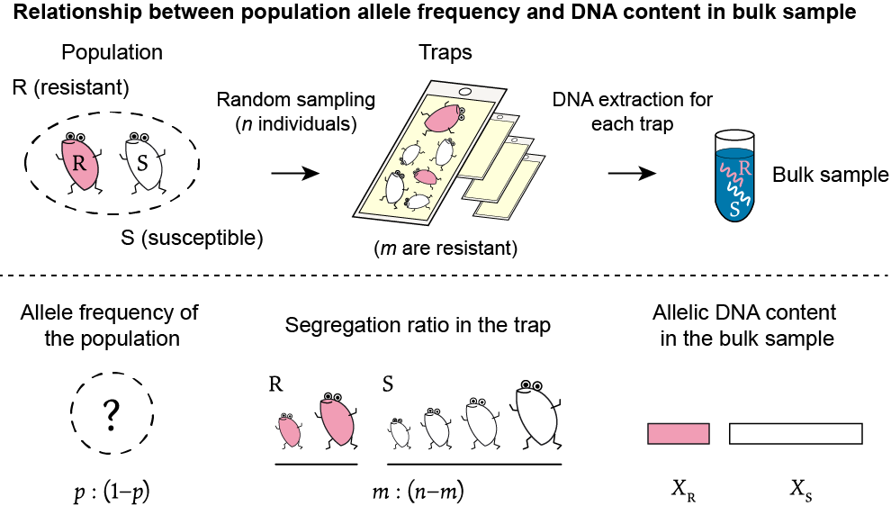
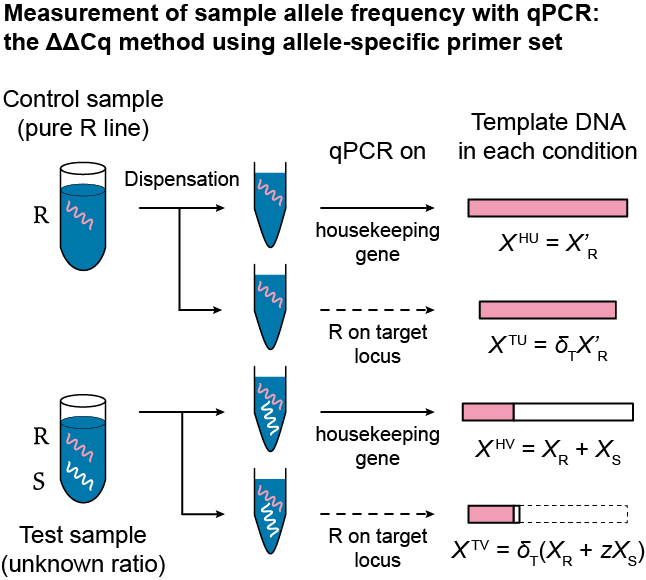

```{r, echo = FALSE}
knitr::opts_chunk$set(
  collapse = TRUE,
  comment = "#>"
)
```

### Masaaki Sudo

Package author: Masaaki Sudo (https://orcid.org/0000-0001-9834-9857)

Estimate the frequency of a specific allele and its confidence interval when the sample allele frequencies are obtained in the form of ΔΔCq in the qPCR analyses on multiple bulk samples collected from a population. Individual DNA yield is approximated using a gamma distribution.

* [日本語解説 (README in Japanese: same with this document)](https://github.com/sudoms/freqpcr/blob/master/README.jp.md)

# External links

* GitHub repository https://github.com/sudoms/freqpcr

* PDF help of the latest version https://github.com/sudoms/freqpcr/releases/latest

* Paper https://doi.org/10.1111/1755-0998.13554 
<br>
Sudo, M., & Osakabe, M. (2021). freqpcr: Estimation of population allele frequency using qPCR ΔΔCq measures from bulk samples. Molecular Ecology Resources, 00, 1–14. Creative Commons Attribution 4.0 International (CC BY 4.0)

* (Preprint at bioRxiv) https://doi.org/10.1101/2021.01.19.427228

* Output data of the numerical experiment in the paper (using v0.3.1) https://figshare.com/collections/freqpcr/5258027

* Mite data set from Osakabe et al. (2017) https://figshare.com/articles/dataset/freqpcr_data_tables/16870816

* Author website https://sudori.info/english.html

---

# TL;DR

Proceed to **[Installation](#Installation)**.

Interval estimation of population allele frequency from qPCR results based on the ΔΔCq methods. Prerequisites are:

* Want to know the percentage of the specific allele at the population level (population allele frequency) relative to other allele(s) on the same locus.

* For the population in question, multiple DNA solutions (bulk samples) have been obtained, each of which consists of multiple individuals extracted at once.

* Quantitative PCR based on the real-time PCR analysis has been performed on each bulk sample and a set of four Cq values is available.

* The ΔΔCq value calculated from the Cq quartet represents the allele frequency of the bulk sample (sample allele frequency).

With the above requirements, we provide a statistical tool to obtain the maximum likelihood estimates of population allele frequency and its asymptotic confidence interval. 

`freqpcr()` function takes as input data the number of individuals included in each bulk sample (`N`) and the set of Cq values (`housek0`, `target0`, `housek1`, `target1`) measured for each bulk sample (since it is a ΔΔCq method, there are usually four Cq values).

Prior to the estimation with samples with unknown allele ratios, auxiliary experimental parameters e.g. amplification efficiency during real-time PCR are required. Functions for estimating experimental parameters (`knownqpcr()` and `knownqpcr_unpaired()` functions) are provided, using multiple DNA solutions with known allele mixing ratios.

---

# Model structure


## Modeling allelic DNA content in a mixed sample solution consisting of multiple individuals

It is a prerequisite that multiple individuals are randomly sampled from a population that contains two alleles (or one allele and others) with unknown frequency $p : (1 - p)$ for the target locus. The primer set used for PCR analysis is designed to amplify the specific allele to be detected (e.g. pesticide resistance allele), otherwise one can digest other allele(s) by restriction enzyme prior to PCR.

Consider a situation where $n$ pests (note that haploidy is assumed for simplicity) are randomly collected, of which $m$ have a pesticide resistance gene (R allele) and the remaining $n - m$ have a susceptibility gene (S allele) (Figure 1). This sampling process is represented by the binomial distribution $m \sim \mathrm{Bin}(n, p)$.

<p align="center">

</p>

> Figure 1. Generation process of a bulk sample. 

If you inspected the genotype of each collected individual, you can know the exact segregation ratio, $m : (n - m)$, in the sample. The estimated value of $p$ and its confidence interval are then calculated from the binomial distribution. There is no particular need to perform quantitative PCR analysis and use `freqpcr`. However, it might not be realistic when the allele of interest is considered rare in the population. Detection of R alleles in the early stages of insecticide resistance development requires the order of 10^-2 ([Sudo et al. 2018](https://doi.org/10.1111/eva.12550)). In the plant quarantine, it is required to figure out the contamination rate of genetically modified crops at 10^-3 or 10^-4. 

In order to detect low-frequency alleles from a large number of samples, a statistical method called "group testing" has been conventionally used. First, DNA is extracted from multiple individuals at once to make a sample solution called a bulk sample. In a typical group test, non-quantitative PCR is performed to amplify the R allele, and it is determined whether each bulk sample contains at least one individual having R (positive sample) or none at all (negative). 

In the procedure of `freqpcr`, quantitative PCR analysis is performed on each bulk sample to quantify the amount of DNA contained in each allele (Figure 1: variables $X_\mathrm{R}$ and $X_\mathrm{S}$). Using the concept of ΔΔCq values, which have been used in quantitative PCR analysis as an indicator of allele content ratio, the `freqpcr()` function returns the estimated allele frequency in the population by maximum likelihood; the upper and lower confidence intervals (the Wald CI) is also calculated. The probability of observing the four Cq values when the $n$ individuals are collected from the population with the allele frequency $p$ is written down as a generative model, where the number of positive individuals ($m$) that would be included in each bulk sample is treated as a latent variable.


### Uncertainty of individual DNA yield: approximation by gamma and beta distributions

Factors such as variation in body size and post-mortem DNA degradation on traps can lead to uncertainty of the DNA yield per individual composing each bulk sample. In `freqpcr`, in addition to the uncertainty in the number of positive individuals in the bulk sample (which follows a binomial distribution), the uncertainty in the DNA yield per allele in the bulk sample (Figures 1 and 2: variables $X_\mathrm{R}$ and $X_\mathrm{S}$) is approximated by a probability distribution called the gamma distribution. The idea is discussed in [Sudo et al. (2021) Journal of Pesticide Science](https://www.jstage.jst.go.jp/article/jpestics/46/2/46_D20-064/_article/-char/en).

Depending on the shape parameters, the gamma distribution can represent the case where DNA is randomly degraded and the yield per individual varies greatly (exponential distribution), and the case where yield is almost normally distributed around the mean value in living organisms. Using the `freqpcr()` function, the shape parameter of the gamma distribution ($k$) is estimated simultaneously with the allele frequency $p$.

One of the desirable properties of the gamma distribution is its reproducible property. If the amount of DNA that each individual has independently follows a gamma distribution (with equal scaling parameters), then the amount of each allele in a bulk sample will also follow a single gamma distribution (Figure 2, left).


<p align="center">

</p>

> Figure 2. Probability distributions to approximate (Left) the amount of R or S allele and (Right) the proportion of R in the bulk sample

Figure 2 is the representation of DNA content when the yield from each individual independently follows $\mathrm{Ga}(k = 1, θ = 10^{-6})$ and the bulk sample consists of six haploid individuals, in which two have the R allele. Then the amount of alleles corresponding to two R individuals is $\mathrm{Ga}(k = 2, θ = 10^{-6})$. On the other hand, the amount corresponding to rest four S individuals follows $\mathrm{Ga}(k = 4, θ = 10^{-6})$. 

Furthermore, due to the nature of the gamma distribution, the content ratio of the two alleles in the bulk sample follows a probability distribution called beta distribution (Figure 2, right). $\mathrm{Beta}(\theta_1 = 2, \theta_1 = 4)$ represents the proportion of R in the aforementioned bulk sample. The standard setting of the `freqpcr()` function adopts a single beta distribution instead of two gamma distributions, which accelerates the estimation (the calculation is completed within several seconds).

Note that the DNA amounts ($X_\mathrm{R}$, $X_\mathrm{S}$) and the proportion of the specific allele ($Y_\mathrm{R}$) shown in Figure 2 assumes the number of individuals $m$ is fixed. In fact, $m$ is also a random variable. For each of $m = 1, 2, ..., n-1$ cases, `freqpcr()` calculates the marginal likelihood as the probability that the actual Cq values are observed under $\mathrm{Beta}(m, n - m)$ ($m=0$ and $m=n$ are treated in a different way). In the following section, it is described how the quartets of Cq values are obtained in the experimental design of ΔΔCq analyses.


---

## Measurement of sample allele frequency using qPCR: ΔΔCq method and RED-ΔΔCq method

As an experimental method to measure the quantities of two alleles in each bulk sample, the current `freqpcr` package officially supports two qPCR methods based on ΔΔCq measure (Figures 3 and 4).

* RED-ΔΔCq method: qPCR with sample pre-treatment with restriction enzymes (Osakabe et al. 2017)

* ΔΔCq method by qPCR using allele-specific primer sets (Maeoka et al. 2020)

[The author (MS)](https://orcid.org/0000-0001-9834-9857) believe that `freqpcr` is also applicable to some of other ΔΔCq and ΔCq-compliant protocols, and collaboration offers are welcome.

### RED-ΔΔCq method

The RED-ΔΔCq method (ΔΔCq Method with Restriction Enzyme Digestion) was first introduced in Osakabe et al. (2017)) to measure the sample allele frequency of acaricide-resistant spider mite. DNA solution with unknown allele mixing ratio on the target locus is dispensed four times into PCR tubes. Real-time PCR is performed under different processing conditions and primer sets, and ΔΔCq is calculated to determine the allele mixing ratio of the solution (Figure 3). 

The PCR uses a primer set that amplifies the target locus independently of the allele (R or S). Half of the dispensed DNA solutions are directly subjected to PCR; resultant Cq value will reflect the amount of template DNA equivalent to the sum of $(X_\mathrm{R} + X_\mathrm{S})$. They are used as the control sample in the RED-ΔΔCq method.

As the test samples, another half of the dispensed solutions are treated with restriction enzymes prior to PCR to digest one of the alleles at the target locus. If the restriction enzyme is applied so that only a small portion of the S allele ($z$) remains, the amount of template for the target gene is equivalent to $(X_\mathrm{R} + zX_\mathrm{S})$. Therefore, if we can obtain the quotient of the template amounts of the test sample and control sample, $(X_\mathrm{R} + zX_\mathrm{S}) / (X_\mathrm{R} + X_\mathrm{S})$, it is approximately the proportion of the R allele $Y_\mathrm{R} = X_\mathrm{R} / (X_\mathrm{R} + X_\mathrm{S})$.


> Note: The allele to be digested by the restriction enzyme can be either R or S. However, in order to improve the precision of the estimation, it is recommended to leave the alleles that are considered to be rare in the population (diminish the ones that are more abundant). For instance, if you want to detect resistance that is rare in a local population, you can use restriction enzymes to treat susceptibility genes. This will result in a large difference in Cq values between the test and control samples and is less likely to be masked by measurement errors in qPCR.

For example, Osakabe et al. (2017) treated a sample solution with Taq1 enzyme for 3 h to quantify the resistance gene in the two-spotted spider mite to the acaricide Ethoxazole. Taq1 recognizes and cuts the sequence TCGA on the DNA. Since Ethoxazole resistance is caused by a mutation from TCG ***A*** TT to TCG ***T*** TT in the chitin synthetase gene (CHS1), the treatment produces a sample in which the S allele on the target locus is digested.

<p align="center">

</p>

> Figure 3. Measurement of sample allele frequency based on the RED-ΔΔCq method

The internal standard, typically a housekeeping gene (GAPDH in Osakabe et al. 2017) is also used to correct the template DNA amount in each sample. As a result, we have four Cq values measured on a single bulk sample.

* $X^{\mathrm{HW}} = X_\mathrm{R} + X_\mathrm{S}$: control sample (intact), housekeeping gene
* $X^{\mathrm{TW}} = \delta_{\mathrm{T}} (X_\mathrm{R} + X_\mathrm{S})$: control sample (intact), target gene
* $X^{\mathrm{HD}} = \delta_{\mathrm{B}} (X_\mathrm{R} + X_\mathrm{S})$: test sample (restriction enzyme), housekeeping gene
* $X^{\mathrm{TD}} = \delta_{\mathrm{B}} \delta_{\mathrm{T}} (X_\mathrm{R} + z X_\mathrm{S})$: test sample (restriction enzyme), target gene

The relationship between template amounts of the target and housekeeping genes are represented using the coefficient $\delta_{\mathrm{T}}$. At the same time, the amount and/or chemical properties of the sample solution may change involuntarily with the restriction enzyme treatment. This size of change is represented as the coefficient $\delta_\mathrm{B}$.

The housekeeping gene is amplified regardless of the genotype of the target locus. Therefore, when we compare the Cq values of the test sample, $X^{\mathrm{TD}}$ divided by $X^{\mathrm{HD}}$ is $X^{\mathrm{TD}} / X^{\mathrm{HD}} = \delta_{\mathrm{T}} (X_\mathrm{R} + z X_\mathrm{S}) / (X_\mathrm{R} + X_\mathrm{S})$. The quantity retains information of the sample allele frequency but the extra $\delta_{\mathrm{T}}$ is still there. 

The size of $\delta_{\mathrm{T}}$ can be extracted as $X^{\mathrm{TW}} / X^{\mathrm{HW}}$. Finally, both $\delta_\mathrm{B}$ and $\delta_\mathrm{T}$ are canceled in $(X^{\mathrm{TD}} / X^{\mathrm{HD}}) / (X^{\mathrm{TW}} / X^{\mathrm{HW}})$ and we obtain $(X_\mathrm{R} + z X_\mathrm{S}) / (X_\mathrm{R} + X_\mathrm{S}) = Y_\mathrm{R} + z (1 - Y_\mathrm{R})$. 
The ratio of the amount of template DNA is the difference in the Cq value (number of cycles before the amplified DNA reaches the threshold). A difference in the Cq values (an amount equivalent to $X^{\mathrm{TD}} / X^{\mathrm{HD}}$ for the test sample and $X^{\mathrm{TW}} / X^{\mathrm{HW}}$ for the control sample) is called ΔCq. The quantity $(X^{\mathrm{TD}} / X^{\mathrm{HD}}) / (X^{\mathrm{TW}} / X^{\mathrm{HW}})$ corresponds to the "difference of two ΔCq values" in the scale of Cq and called ΔΔCq. Such definitions of ΔCq and ΔΔCq follow the methodology of standard real-time PCR protocols (Livak and Schmittgen 2001; Vandesompele et al. 2002).

> Note: $(X_\mathrm{R} + z X_\mathrm{S}) / (X_\mathrm{R} + X_\mathrm{S}) = Y_\mathrm{R} + z (1 - Y_\mathrm{R})$ is not itself, but an approximation of the sample allele frequency as long as the exact size of $z$ is unknown. Therefore, Osakabe et al. (2017) recommend performing restriction enzyme treatment for a long time to make $z$ as small as possible. On the other hand, in the scope of the `freqpcr` package we can estimate the size of $z$ using helper functions (`knownqpcr()` or `knownqpcr_unpaired()`). Rather, if $z$ is too small (less than $10^{-5}$), the realtime PCR cycles required for "test sample, target gene" is too long when a specific bulk sample does not contain R alleles, and the reaction may not start up. 


### ΔΔCq method by qPCR using allele-specific primer sets

The RED-ΔΔCq method of Osakabe et al. (2017) can measure the allele mixing ratio of the unknown DNA solution without a calibration curve though there is a constraint that one the restriction enzyme that can digest one of the alleles on the target locus is required. Maeoka et al. (2020) proposed a modified ΔΔCq method that can measure the sample allele, in which an allele-specific primer set is used to amplify one allele on the target locus (Figure 4).

<p align="center">

</p>

> Figure 4. ΔΔCq method by qPCR using allele-specific primer sets (Maeoka et al. 2020)

Similar to the RED-ΔΔCq method, the samples (test and control) are amplified with primer set corresponding to the target and housekeeping gene. However, the control sample is not the undigested portion of the bulk sample, but a DNA solution extracted from individuals that have been confirmed by individual genetic diagnosis to have only R allele (pure R sample). The template DNA amounts are:

* $X^{\mathrm{HU}} = X'_\mathrm{R}$: control sample (pure R), housekeeping gene
* $X^{\mathrm{TU}} = \delta_{\mathrm{T}} X'_\mathrm{R}$: control sample (pure R), target gene
* $X^{\mathrm{HV}} = X_\mathrm{R} + X_\mathrm{S}$: test sample, housekeeping gene
* $X^{\mathrm{TV}} = \delta_{\mathrm{T}} (X_\mathrm{R} + z X_\mathrm{S})$: test sample, target gene

The allele-specific primer set is designed to bind only to the R allele on the target locus. Therefore, all of the control sample and the R portion of the test sample are amplified. $z$ in this method is the small fraction of the S-allele that is subject to nonspecific amplification. The DNA amount of the control is not $X$, but $X'$ because the origin is different.

In the same way as the RED-ΔΔCq, the size of $\delta_{\mathrm{T}}$ can be extracted as $X^{\mathrm{TU}} / X^{\mathrm{HU}}$ using the control sample. The ΔΔCq is defined as $(X^{\mathrm{TV}} / X^{\mathrm{HV}}) / (X^{\mathrm{TU}} / X^{\mathrm{HU}})$, which also leads to $(X_\mathrm{R} + zX_\mathrm{S}) / (X_\mathrm{R} + X_\mathrm{S})$.


### Calculating sample allele frequency on ΔCq and $\delta_{\mathrm{T}}$ 

> This is a test implementation.

If the size of $\delta_\mathrm{T}$ is known, only the test samples amplified with the target gene and the housekeeping gene will be enough; first to measure the Cq values corresponding to $X^{\mathrm{TV}}$ and $X^{\mathrm{HV}}$, and then subtracting the amount equivalent to $\delta_\mathrm{T}$. This is so called a ΔCq method. In version 0.4.0, the `freqpcr()` function has been extended to accept datasets lacking control samples.

In this case, $\delta_\mathrm{T}$ (argument `targetScale` in the `freqpcr()` function) and $\sigma_\mathrm{c}$,  the standard deviation of the normal error that the measured Cq value follows (the `sdMeasure` argument) are estimated in advance with sample solutions whose allele mixing ratios are known. You can use the `knownqpcr()` or `knownqpcr_unpaired()` functions as described in the section below. If you have a very large number of bulk samples, it is possible to estimate the two arguments together with the population allele frequency inside the `freqpcr()` function, but you should assign them as fixed values in most cases. Without the control samples, the number of data points for estimation is halved, and a large number of unknown parameters causes a large bias in the estimation results.


<p align="center">

</p>


> Figure 5. Calculating sample allele frequency on ΔCq


## Interval estimation of population allele frequency based on multiple bulk samples

In Osakabe et al. (2017) and Maeoka et al. (2020), each bulk sample was analyzed using qPCR under the aforementioned conditions, and the frequency of the relevant allele of each bulk sample (point estimate) was calculated from the ΔΔCq value as $2^{-ΔΔ\mathrm{Cq}}$.

In order to estimate the confidence interval, multiple ($N$) bulk samples taken from single population are required. You can place multiple trap sites at a single locality and extracted DNA from each trap to constitute a bulk sample, or a large number of captured individuals on single site can be divided into N groups. In `freqpcr`, the number of individuals $n_h$ $(h = 1, 2, ..., N)$ can be different for each bulk sample, but it is essential to record how many individuals are included in each bulk sample.


Under a certain total capture, the more samples are divided (fewer individuals per bulk sample), the narrower the width of the confidence interval and the higher the estimation accuracy and precision. However, the labor for the qPCR analysis also increases. The simulation results of the estimation accuracy/precision depending on the number of divisions of the bulk sample are shown in [Figure 4 in the original paper](https://onlinelibrary.wiley.com/doi/10.1111/1755-0998.13554#men13554-sec-0015-title) and [ESM1](https://onlinelibrary.wiley.com/doi/10.1111/1755-0998.13554#support-information-section).


---

## Diploidy

The model structure of `freqpcr` basically assumes a haploid organism. That is, each cell that constitutes an individual has one chromosome and contains one allele DNA. The `freqpcr()` function, which performs allele frequency estimation, has an optional flag `diploid`, which is by default set to `diploid = FALSE`.
Many insects and vertebrates are diploid, i.e. each cell has two homologous chromosomes. We can handle diploid organisms by running the `freqpcr()` function with `diploid = TRUE`.

In the `freqpcr()` function, the vector variable `N` is used to assign the number of individuals that make up the bulk sample. Whether `diploid = TRUE` or `diploid = FALSE`, `N` is assigned as the number of individuals, not the number of chromosome sets. For instance, `N = c(8, 8, 8, 6)` means that a total of 30 individuals were collected and analyzed in four bulk samples, of which three consists of DNA extracted from eight individuals, and rest one consists of the remaining six.

Note that the model representation of individual DNA yield in diploid organisms is simplified in `freqpcr()`. The details are described in [Appendix S1 of the original paper](https://onlinelibrary.wiley.com/action/downloadSupplement?doi=10.1111%2F1755-0998.13554&file=men13554-sup-0001-AppendixS1.docx); in a nutshell, the quantification of two sets of alleles owned by the same individual is not exact.

Essentially, the amount of allelic DNA obtained from a diploid individual is exactly twice the haploid. In particular, the amount of R-allele and S-allele in a heterozygous individual should be the same, but this constraint significantly increases the computational burden. Therefore, instead of "collecting n diploid organisms", we used the trick of "pretending to have collected 2n diploid organisms." In this way, the amount of DNA in two sets of alleles from the same individual will distribute independent and identically, thereby we can apply the same model with haploidy. This simplified estimation method is not considered to affect the maximum likelihood estimate (point estimate) of the allele frequency p, but the confidence interval will be estimated slightly wider.


---

## freqpcr assuming continuous DNA quantities (eDNA)

(Under construction)


---


# Dependency

* R (>= 3.6)
* cubature (https://cran.r-project.org/package=cubature)

# Installation

```{r, eval = FALSE}
library(remotes)
install_github("sudoms/freqpcr")

library(freqpcr)
packageVersion("freqpcr")
```

If there are errors (converted from warning), it might be the case the dependent package 'cubature' has been built on a newer version of R (https://github.com/r-lib/remotes/issues/403).

```{r, eval = FALSE}
** byte-compile and prepare package for lazy loading
Error: (converted from warning) package 'cubature' was built under R version 3.6.3
```

Then, set the following environment variable: R_REMOTES_NO_ERRORS_FROM_WARNINGS="true" and run install_github() again.

```{r, eval = FALSE}
Sys.setenv(R_REMOTES_NO_ERRORS_FROM_WARNINGS="true")
install_github("sudoms/freqpcr")
```

# Usage

```{r}
library(freqpcr)
```

## Variables and parameters

P:
* Population allele frequency to be estimated

K:
* Shape parameter of the gamma distribution used to approximate the individual DNA yield

The sizes of the following parameters depend on your experimental system. You should estimated them beforehand using either of the `knownqpcr()` and `knownqpcr_unpaired()` functions. 
**Bold** is a parameter whose value must be specified by the user, otherwise `freqpcr()` does not work. 
***Bold and italic*** is a parameter which is not mandatory but should be specified as much as possible. Especially, when you have few bulk samples, the estimation results will be greatly biased if `sdMeasure` is not specified as a fixed parameter.


**EPCR**:

* A positive real number representing the amplification efficiency per PCR cycle.

* When `EPCR = 1`, the template DNA increases by a factor of 2 per PCR cycle (i.e., EPCR + 1 = 2, which has been conventionally used in real-time PCR).

**zeroAmount**:

* (In the RED-ΔΔCq method) the percentage of allelic DNA remaining after the restriction enzyme reaction that degrades the non-detectable allele at the target locus.

* (In the general ΔΔCq method) the percentage of non-detectable alleles that are amplified to a very small extent in a PCR reaction using allele-specific PCR primer sets  (relative to the template value, where the template amount of the target allele is 1).

* Should be specified by the user as a real number between 0 and 1 in the `freqpcr()` function.

***sdMeasure***:

* Size of the random error (standard deviation) that each Cq (Ct) value follows in a qPCR analysis. Variable expressed as $\sigma_\mathrm{c}$ in the paper. The error distributes normally on the scale of Cq values (see [Experiment 1 in the original paper](https://onlinelibrary.wiley.com/doi/10.1111/1755-0998.13554#men13554-sec-0010-title)).

***targetScale***:

* Relative DNA amount of the target locus compared with the housekeeping gene. The variable expressed as $\delta_\mathrm{T}$ in the paper.

scaleDNA:

* Relative amount of the template DNA (of the housekeeping gene) compared to the threshold of realtime PCR. If DNA increases exactly twofold in one PCR cycle (`EPCR = 1`), then it reaches the threshold in one PCR cycle when `scaleDNA = 0.5`. As can be deduced from $2^{10} = 1024$, `scaleDNA` = $10^{-6}$ corresponds to a Cq value of $\approx20$.

* Note that it is not the argument of the `freqpcr()` function, because it fixes once `EPCR` is determined.

baseChange:

* Relative amount of the template DNA (of the housekeeping gene) before and after the restriction enzyme treatment in the RED-ΔΔCq method (as an involuntary change due to experimental manipulation). $\delta_\mathrm{B}$ in the original paper.

* The variable does not exist in the method of Maeoka et al. (2020) and other common ΔΔCq methods. In any case, it is not used in the `freqpcr()` function because the function internally converts the four Cq values into two ΔCq values before feeding them into the likelihood function (See [Equation 11 in the paper](https://onlinelibrary.wiley.com/doi/10.1111/1755-0998.13554#men13554-disp-0014) for details.)


> This does not mean that there is no parameter equivalent to `baseChange` in any ΔΔCq-based analysis other than the RED-ΔΔCq method. Even without restriction enzyme treatment, there may be experimental manipulations that give some systematic errors in the amount of template DNA between experimental levels. 


---


## Estimation of auxiliary experimental parameters with knownqpcr() or knownqpcr_unpaired()

Also see [Experiment 1 in the original paper](https://onlinelibrary.wiley.com/doi/10.1111/1755-0998.13554#men13554-sec-0010-title).

Since the sizes of the auxiliary parameters vary depending on the thermal cycler used and the experimental protocol, it is necessary to determine them beforehand in each laboratory even when testing the same gene of the same species. The first step is to prepare a DNA solution in which the mixing ratio of alleles is strictly known. Following the general protocol for qPCR, make a dilution series of the allele to be detected (R allele) with another (S). The mixing ratios at least should cover the range from the upper to the lower limit of the expected R frequency range. It is recommended to include the combinations equivalent to the R frequencies $Y_\mathrm{R} = 0$ and $Y_\mathrm{R} = 1$, which stabilizes the estimation results.

> Note: The mixed DNA solutions need to contain not only the target gene but also the housekeeping gene, as in the real test samples. A reliable method is to incubate pure R and S strains, extract the DNA, and then match the concentrations using some nucleic acid quantification method, and then mix them.

Then, conduct a qPCR analysis in the same way as the real test samples. If you use the RED-ΔΔCq method, each of the prepared solutions is dispensed four times and subject to the experimental procedure described in Figure 3. You have four Cq measurements corresponding to $X^{\mathrm{HW}} $, $X^{\mathrm{TW}}$, $X^{\mathrm{HD}}$, and $X^{\mathrm{TD}}$.

If other ΔΔCq methods (e.g. Maeoka et al. 2020) and ΔCq-based methods are used, each DNA solution with known mixing ratio is dispensed two times and subject to the qPCR analysis described in Figure 4 or Figure 5. In both cases, there are only the samples corresponding to $X^{\mathrm{HV}}$ and $X^{\mathrm{TV}}$. 

> Note: If we have a solution with a mixing ratio of $R:S = 1:0$, it is essentially the same as "control." However, when preparing the data, the Cq values obtained from the pure R solution should be included in HV (housekeeping gene, test sample) or TV (target gene, test sample) instead of control.

The resultant Cq values are put into one of the functions `knownqpcr()` or `knownqpcr_unpaired()` to obtain the maximum likelihood estimates of the experimental parameters. The two functions return the same result and you can use them interchangeably depending on your data format (wide or long). See the PDF help of the package for details.

### Dummy Cq data generation

We start from creating a dummy Cq dataset for illustration.

```{r, results = "hide"}
# Example: R and S are mixed at the exact ratios 1:9, 1:3, 1:1, and 1:0.
# Four dummy bulk samples are generated for each combination. 
# Template DNA amounts follows the gamma distribution.
# K:2, scaleDNA:1e-11, targetScale:1.5, baseChange:0.3, zeroAmount:1e-3,
# sdMeasure:0.3, and EPCR:0.95. 

A <- rep(1, 16)
trueY <- c(rep(0.1, 4), rep(0.25, 4), rep(0.5, 4), rep(1, 4))
housek0 <- c( 19.39, 19.78, 19.28, 19.58,  18.95, 19.91, 19.66, 19.96,
              20.05, 19.86, 19.55, 19.61,  19.86, 19.27, 19.59, 20.21 )
target0 <- c( 19.16, 19.08, 19.28, 19.03,  19.17, 19.67, 18.68, 19.52,
              18.92, 18.79, 18.8, 19.28,   19.57, 19.21, 19.05, 19.15 )
housek1 <- c( 21.61, 21.78, 21.25, 21.07,  22.04, 21.45, 20.72, 21.6,
              21.51, 21.27, 21.08, 21.7,   21.44, 21.46, 21.5, 21.8 )
target1 <- c( 24.3, 24.22, 24.13, 24.13,   22.74, 23.14, 23.02, 23.14,
              21.65, 22.62, 22.28, 21.65,  20.83, 20.82, 20.76, 21.3 )
d.cmp <- data.frame(A, trueY, housek0, target0, housek1, target1)
print(d.cmp)
```

The variable `A` is the "relative template DNA concentration" and affects the estimated size of the `scaleDNA`. It is convenient to regard `A = 1` as the amount of the housekeeping gene when the solution extracted from single individual and dispensed in a PCR tube. If you don't specify `A`, default value 1.0 is used.

### knownqpcr() on RED-ΔΔCq dataset

First, we shows the procedure for estimating the experimental parameters of a RED-ΔΔCq analysis using the `knownqpcr()` function. We input four different Cq values and the exact allele frequency as vectors of length 16.


```{r}
# housek0: control sample (intact), housekeeping gene
# target0: control sample (intact), target gene
# housek1: test sample (restriction enzyme), housekeeping gene
# target1: test sample (restriction enzyme), target gene
# trueY  : exact frequency of R allele
# A      : relative concentration of template DNA (not necessary)

result <- knownqpcr(housek0=d.cmp$housek0, target0=d.cmp$target0,
                    housek1=d.cmp$housek1, target1=d.cmp$target1,
                    trueY=d.cmp$trueY, A=d.cmp$A, verbose=FALSE)
print(result)
```


Returned value is a list containing the summary table of the estimated parameters as `$report`. You can input the maximum likelihood estimates (Estimate) to the corresponding arguments of `freqpcr()` function.


### knownqpcr() on general ΔΔCq dataset

In contrast, the data from general ΔΔCq analysis consist of two conditions per bulk sample: amplified for housekeeping or target gene. In this case, the `knownqpcr()` function takes two Cq vectors, `housek1` and `target1`.

```{r}
# housek1: sample with known ratio, housekeeping gene
# target1: sample with known ratio, target gene, allele specific primer set

result <- knownqpcr(housek1=d.cmp$housek1, target1=d.cmp$target1,
                    trueY=d.cmp$trueY, A=d.cmp$A, verbose=FALSE)
print(result)
```

The returned list is similar to that of RED-ΔΔCq, but `baseChange` is not estimated when the `housek0` and `target0` are not input. Also, the estimation accuracy of `zeroAmount` is inferior to that of input data containing `housek0` and `target0` To improve this, it is necessary to increase the samples with mixing ratios biased to S (small $Y_\mathrm{R}$).


### Estimation with knownqpcr_unpaired()

Depending on the experiment design, the Cq values measured on the four conditions (with or without restriction enzymes, housekeeping or target gene) in the RED-ΔΔCq analysis for the same sample are not always prepared as a set. For example, in Osakabe et al. (2017), the condition without restriction enzyme treatment is set only for the mixing ratio of $R:S = 1:0$ ($Y_\mathrm{R} = 1$). 


The `knownqpcr_unpaired()` function can be used to measure the experimental parameters even from Cq dataset with such incomplete design.

> This is not a "missing data." You can deal with simple missing data in a complete design by filling them with `NA` and use `freqpcr()`.

```{r, results = "hide"}
A <- rep(1, 16)
trueY <- c(rep(0.1, 4), rep(0.25, 4), rep(0.5, 4), rep(1, 4))
housek0 <- c( 19.39, 19.78, 19.28, 19.58,  18.95, 19.91, 19.66, 19.96,
              20.05, 19.86, 19.55, 19.61,  19.86, 19.27, 19.59, 20.21 )
target0 <- c( 19.16, 19.08, 19.28, 19.03,  19.17, 19.67, 18.68, 19.52,
              18.92, 18.79, 18.8, 19.28,   19.57, 19.21, 19.05, 19.15 )
housek1 <- c( 21.61, 21.78, 21.25, 21.07,  22.04, 21.45, 20.72, 21.6,
              21.51, 21.27, 21.08, 21.7,   21.44, 21.46, 21.5, 21.8 )
target1 <- c( 24.3, 24.22, 24.13, 24.13,   22.74, 23.14, 23.02, 23.14,
              21.65, 22.62, 22.28, 21.65,  20.83, 20.82, 20.76, 21.3 )

# When the combination of (with or without restriction enzyme) is incomplete,
# the R data frame can be prepared in "long" format.
# First, make a complete data frame and then extract a subset.
d.long.all <- data.frame(
    trueY=rep(trueY, 4), 
    Digest=c(rep(0, 16 + 16), rep(1, 16 + 16)),
    Gene=c(rep(0, 16), rep(1, 16), rep(0, 16), rep(1, 16)),
    A=rep(1, 16*4), 
    Cq=c(housek0, target0, housek1, target1) )

# For example, samples without restriction enzyme (Digest == 0) are only available if trueY == 1.
d.long <- d.long.all[d.long.all$Digest == 1 | d.long.all$trueY == 1, ]
print(d.long)

result <- knownqpcr_unpaired(   Digest=d.long$Digest, Gene=d.long$Gene,
                                trueY=d.long$trueY, Cq=d.long$Cq, A=d.long$A   )
```

The Cq data in "long" format created above looks like:

```{r, eval = FALSE}
> print(d.long)
   trueY Digest Gene A    Cq
13  1.00      0    0 1 19.86
14  1.00      0    0 1 19.27
15  1.00      0    0 1 19.59
16  1.00      0    0 1 20.21
29  1.00      0    1 1 19.57
30  1.00      0    1 1 19.21
31  1.00      0    1 1 19.05
32  1.00      0    1 1 19.15
33  0.10      1    0 1 21.61
34  0.10      1    0 1 21.78
35  0.10      1    0 1 21.25
36  0.10      1    0 1 21.07
37  0.25      1    0 1 22.04
38  0.25      1    0 1 21.45
39  0.25      1    0 1 20.72
40  0.25      1    0 1 21.60
41  0.50      1    0 1 21.51
...
all following rows are Digest = 1, i.e., qPCR with restricted enzyme.
```

---

## Estimation of population allele frequency using freqpcr()

### Assign the estimated parameter values to R variables

```{r}
targetScale <- 1.2
sdMeasure <- 0.2
scaleDNA <- 1e-06
baseChange <- 0.2

# For the following parameters, we input arbitrary value
P <- 0.15
K <- 4
EPCR <- 0.97
zeroAmount <- 0.0016
```

### Create a dummy Cq dataset for running freqpcr() demo

Assume that 32 individuals of a haploid organism have been collected (monophyletic organisms), from which four bulk samples of 8 individuals each have been prepared. With the `make_dummy()` function provided in the `freqpcr` package, we can generate the dummy Cq measurement data obtained by quantitative PCR. The function output is not the data frame as we have seen, but a unique format having the S4 class `CqList`. Since we set `K <- 4` and `scaleDNA <- 1e-06`, the DNA amount of each individual is generated as a random number following $\mathrm{Ga}(k = 4, θ = 10^{-6})$.


```{r}
dmy_cq <- make_dummy(   rand.seed=71, P=P, K=K, ntrap=4, npertrap=8,
                        scaleDNA=scaleDNA, 
                        targetScale=targetScale, 
                        baseChange=baseChange,
                        EPCR=EPCR, 
                        zeroAmount=zeroAmount,
                        sdMeasure=sdMeasure, 
                        diploid=FALSE   )
print(dmy_cq)
```

The return value of `make_dummy()` contains conventional point estimates of the sample allele frequencies in addition to the Cq values of the bulk samples and their ΔCq and ΔΔCq values. Both `RFreqMeasure` and `ObsP` are point estimates of the sample allele frequency calculated as `(1 + EPCR)^(-ΔΔCq)`; the latter is defined as min(1, RFreqMeasure) because the range of the former can potentially exceeds 1.


### Estimation with freqpcr()

You can try the estimation of population allele frequencies using `freqpcr()` extracting `N`, `housek0`, `target0`, `housek1`, and `target1` from the dummy Cq dataset. This specification applies to both the RED-ΔΔCq and ΔΔCq methods.

When you provide your own data, `N` is the vector of the number of individuals constituting each bulk sample. The four Cq vector must have the same length (=number of bulk samples) with `N`; if there are missing values, they must be filled with `NA` so that .

```{r, results = "hide"}
# Access the keys of an S4 object with @ instead of $. They are extracted as vector.
N <- dmy_cq@N
housek0 <- dmy_cq@housek0
target0 <- dmy_cq@target0
housek1 <- dmy_cq@housek1
target1 <- dmy_cq@target1

# freqpcr() with beta assumption, assuming haploidy, print every optimization step
result <- freqpcr(  N=N, housek0=housek0, target0=target0,
                    housek1=housek1, target1=target1,
                    EPCR=EPCR, zeroAmount=zeroAmount, 
                    beta=TRUE, diploid=FALSE, print.level=2  )
print(result)
```


In the result of the `freqpcr()` function, SE and confidence intervals are not printed for fixed parameters. The raw outputs of internal parameter optimization by `nlm()` are stored in the "obj" slot. `@obj$code` is the exit status of `nlm()` and `@obj$iterations` is the number of iterations until convergence. Wald confidence intervals are computed with the SEs obtained from the diagonal components of the Hessian matrix at the last iteration.


```{r, eval = FALSE}
> print(result)
An object of class "CqFreq"
Slot "report":
                                    Estimate Fixed  (scaled) (scaled.SE)       2.5%       97.5%
P (R-allele frequency)            0.09773189     0 -2.222684  0.60914923 0.03178086   0.2633220
K (gamma shape parameter)        20.92728471     0  3.041054  1.83522515 0.57354355 763.5884712
targetScale (rel. DNA quantity)   1.11922896     0  0.112640  0.08911953 0.93985370   1.3328388
sdMeasure (Cq measurement error)  0.20973065     0 -1.561931  0.32845070 0.11017528   0.3992451
EPCR (amplification per cycle)    0.97000000     1        NA          NA         NA          NA

Slot "obj":
$minimum
[1] 6.094915

$estimate
[1] -2.222684  3.041054  0.112640 -1.561931

$gradient
[1] -3.400973e-05 -8.275889e-05 -5.170087e-05  8.878422e-05

$hessian
            [,1]        [,2]       [,3]       [,4]
[1,]  2.71023719  0.05094362   1.168535 -0.1766756
[2,]  0.05094362  0.37630056   2.045198 -0.6539723
[3,]  1.16853469  2.04519835 147.389558  6.4578190
[4,] -0.17667556 -0.65397228   6.457819 11.1504636

$code
[1] 1

$iterations
[1] 12


Slot "cal.time":
   user  system elapsed
   0.72    0.15    0.88
```

If the exact sizes of a part of the parameters (e.g., $K$) are known, specify the values of the corresponding arguments. They are processed as fixed parameters.

```{r, eval = FALSE}
result <- freqpcr(  N=N, housek0=housek0, target0=target0,
                    housek1=housek1, target1=target1,
                    K = 1,
                    EPCR=EPCR, zeroAmount=zeroAmount, beta=TRUE, print.level=1  )
```


If the analysis conforms to the ΔCq method instead of the ΔΔCq method, do not specify `housek0` and `target0`. If there is no `housek0` and `target0`, it is strongly recommended to give fixed values for `targetScale` and `sdMeasure` in addition to `EPCR` and `zeroAmount`.


### freqpcr() on ΔCq analysis

If the analysis is based not on a ΔΔCq, but on ΔCq method, `freqpcr()` runs without specifying `housek0` and `target0`. In this case, it is strongly recommended to give fixed values for `targetScale` and `sdMeasure` in addition to `EPCR` and `zeroAmount`. This is because if the value of `sdMeasure` becomes too large or too small during the optimization process, it will prevent the model from converging properly.

```{r, eval = FALSE}
result <- freqpcr(  N=N, housek1=housek1, target1=target1,
                    targetScale=1.2, sdMeasure=0.2,
                    EPCR=EPCR, zeroAmount=zeroAmount, beta=TRUE, print.level=1  )
```

Other options are covered in the PDF help of the package.

> It is possible to choose to use a beta distribution or two gamma distributions in `freqpcr()`, as the behavior was investigated in the original paper. The default is `freqpcr(..., beta=TRUE, ...)` and maximum likelihood estimation is performed according to the model that uses the beta distribution. To estimate population allele frequencies $p$, `beta=TRUE` is advantageous in most situations, both in terms of execution time and success probability of interval estimation.

## Fixing parameters for freqpcr()

Estimation using the `freqpcr()` function at least requires the observation data of `N`, `housek0`, `target0`, `housek1`, and `target1` for the analysis based on the RED-ΔΔCq and ΔΔCq methods. For a ΔCq-based analysis, `N`, `housek1`, and `target1` are mandatory. 

As for the experiment-related parameters, `zeroAmount` should always be fixed because it cannot be estimated in the `freqpcr()` function. 

> The other parameters are optional and "***if the user specifies a value, it is fixed, and the unspecified arguments are used as the unknown parameters subject to maximum likelihood estimation***".

The `EPCR`, which is the amplification efficiency of PCR, can be estimated in principle. Due to the structure of the freqpcr model, however, the maximum likelihood estimation will be unstable if it is left unknown. The user should give the value measured by `knownqpcr()` or `knownqpcr_unpaired()`.

The `targetScale` and `sdMeasure` can be estimated in `freqpcr()` if the number of bulk samples (how many bulk samples there are) is sufficient. However, fixed values are recommended. In addition to stabilizing the convergence when the sample size is small, it speeds up the execution of the `nlm()` function by reducing unknown variables.

There are two ways, implicitly or explicitly, to indicate that a variable is to be estimated.

1. By not including the argument in the command

1. Stating that the value of the variable is `NULL`: e.g. `freqpcr(... , K=NULL, ...)`

Both will have the same result. The former is easier to write, but if you want to explicitly show which variables are unknown, the latter is a good choice.

> Note: `EPCR` is an exception to the above rule. Unless you explicitly state `EPCR=NULL`, the estimation process runs assuming that its default value, 0.99, is entered. In actual operation, it is strongly recommended to use the value determined by `knownqpcr()` or `knownqpcr_unpaired()`.

---

# Misc

## Required sample size


As described in the [paper](https://onlinelibrary.wiley.com/doi/10.1111/1755-0998.13554#men13554-sec-0015-title), the required sample size varies depending on the assumed range of $p$. From numerical experiments, if the total number of individuals (as haploids), `ntotal` is $> 3/p$, the interval estimation will be successful in many cases. Then, the 95\% confidence interval of p roughly falls within the range of $[p/3, 3p]$.

`ntotal` $> 3/p$ is consistent with the rule of thumb known as the "rule of three". The rule describes the condition that "it is expected that at least one positive individual is included in the collected sample." If all individuals are negative, the point estimate of $p$ is 0, which means you won't be able to say anything other than that the probability is smaller than a certain size. Accordingly, it makes sense as the minimum sample size for running `freqpcr()`.


## To circumvent frequent missing values of target1

When the expected frequency of R allele in a population is small, bulk samples that contain no R are often obtained. In addition, if the duration of restriction enzyme treatment in the RED-ΔΔCq method is longer, the residue rate of S $z$ will be very small. When the two conditions are combined, the reaction may not start up  in the real-time PCR even after the maximum cycle number set in the thermal cycler. In other words, the Cq value of `target1` is often missing.

You may think to discard the Cq observations of the bulk sample for which `target1` was obtained, and put the rest into `freqpcr()`. However, this may not be appropriate; the very act of selecting only the samples in which the reaction started up has the effect of arbitrarily selecting the samples containing R individuals.

As a practical solution to this problem, [Equation 11 of the paper](https://onlinelibrary.wiley.com/doi/10.1111/1755-0998.13554#men13554-disp-0014) can be used. If we set $x_\mathrm{R} = 0$ in the latter part of the equation ($\Delta\tau_\mathrm{h}^\mathrm{D}$), we can see that it follows the normal distribution $\mathrm{N}(-\mathrm{ln}(\delta_\mathrm{T}z)/\mathrm{ln}(1+\eta), 2\delta_\mathrm{c}^2)$. $\Delta\tau_\mathrm{h}^\mathrm{D}$ is nothing but the difference between `target1` and `housek1`. That is, the expected value of `target1` obtained by adding the quantity `-log(targetScale*zeroAmount)/log(1+EPCR)` to `housek1` of the corresponding bulk sample.

For example, if `EPCR = 0.9, zeroAmount = 0.00005, targetScale = 0.6, sdMeasure = 0.4` stands and you have observed the Cq values as `housek1 <- c(25.0, 26.0, 25.5)` and `target1 <- c(35.3, NA, 34.9)`. This means that `target1` is missing in the second bulk sample. In this case, we get $-\mathrm{ln}(0.6*0.00005)/\mathrm{ln}(1+0.9) = 16.22536$. The value that should be inserted into `target1` is calculated as 26.0+16.22536 = 42.2.

> (The current `freqpcr()` has not implemented the auto-completion of `target1`. Note that this procedure was not included in the published article)

In fact, the validity of the result is not guaranteed if we only assigned this value. It is better to try the estimation with `freqpcr()` while changing the value in the range of $42.2\pm 10$, and show that the estimated P converges to a reasonable range.

```{r}
# Insert the expected size for target1 
x <- 16.2
N <- c(20, 20, 20)
housek0 <- c(20.5, 25.0, 25.6)
target0 <- c(20.5, 25.5, 26.5)
housek1 <- c(25.0, 26.0, 25.5)
target1 <- c(35.3, 26.0 + x, 34.9)
result <- freqpcr(  N=N, housek0=housek0, target0=target0,
                    housek1=housek1, target1=target1,
                    EPCR=0.9, zeroAmount=0.00005, targetScale=0.6,
                    sdMeasure=0.4, beta=TRUE, diploid=TRUE, print.level=0  )

# Try the expected size + 10
x <- 16.2 + 10
target1 <- c(35.3, 26.0 + x, 34.9)
result <- freqpcr(  N=N, housek0=housek0, target0=target0,
                    housek1=housek1, target1=target1,
                    EPCR=0.9, zeroAmount=0.00005, targetScale=0.6, 
                    sdMeasure=0.4, beta=TRUE, diploid=TRUE, print.level=0  )
```

Be sure to fix `sdMeasure` and `targetScale`. Otherwise, the estimated values will deviate significantly.

---

# Citation
```{r}
citation("freqpcr")
```


# Package author

Masaaki Sudo (https://orcid.org/0000-0001-9834-9857) 
* National Agriculture and Food Research Organization (NARO), Japan
* https://sudori.info/english.html

# License

GNU GPL (>= 3)

    This program is free software: you can redistribute it and/or modify
    it under the terms of the GNU General Public License as published by
    the Free Software Foundation, either version 3 of the License, or
    (at your option) any later version.

    This program is distributed in the hope that it will be useful,
    but WITHOUT ANY WARRANTY; without even the implied warranty of
    MERCHANTABILITY or FITNESS FOR A PARTICULAR PURPOSE.  See the
    GNU General Public License for more details.

    You should have received a copy of the GNU General Public License
    along with this program.  If not, see <http://www.gnu.org/licenses/>.

`freqpcr` is licensed under GPL following the `cubature` package used inside for numerical integration.

# History
* v0.4.0 (2021.12.xx) Vignette and Japanese readme were added.
* v0.3.5 (2021.02.17) Fixed: "Lapack routine dgesv: system is exactly singular" in knownqpcr() when Cq contained NAs
* v0.3.4 (2021.02.16) Released version of 0.3.3 (the code did not change)
* v0.3.3 (2021.02.13) Continuous distribution in sample allele ratio was supported. knownqpcr() function now officially accepts missing Cq observations (NA).
* v0.3.2 (2021.01.29) Fixed: R version ~~2.14~~ -> 3.6 and higher
* v0.3.1 (2021.01.20) First published (first draft of the preprint)

# Referenes
* Livak, Kenneth J., & Schmittgen, T. D. (2001). Analysis of relative gene expression data using real-time quantitative PCR and the 2- ΔΔCT method. Methods, 25(4), 402–408.
* Maeoka, A., Yuan, L., Itoh, Y., Saito, C., Doi, M., Imamura, T., Yamaguchi, T., Imura, T., & Osakabe, M. (2020). Diagnostic prediction of acaricide resistance gene frequency using quantitative real-time PCR with resistance allele-specific primers in the two-spotted spider mite Tetranychus urticae population (Acari: Tetranychidae). Applied Entomology and Zoology, 55, 329–335. https://doi.org/10.1007/s13355-020-00686-7
* Osakabe, M., Imamura, T., Nakano, R., Kamikawa, S., Tadatsu, M., Kunimoto, Y., & Doi, M. (2017). Combination of restriction endonuclease digestion with the ΔΔCt method in real-time PCR to monitor etoxazole resistance allele frequency in the two-spotted spider mite. Pesticide Biochemistry and Physiology, 139, 1–8. https://doi.org/10.1016/j.pestbp.2017.04.003
* Sudo, M., & Osakabe, M. (2021). freqpcr: Estimation of population allele frequency using qPCR ΔΔCq measures from bulk samples. Molecular Ecology Resources, 00, 1– 14. https://doi.org/10.1111/1755-0998.13554 
* Sudo, M., Yamamura, K., Sonoda, S., & Yamanaka, T. (2021). Estimating the proportion of resistance alleles from bulk Sanger sequencing, circumventing the variability of individual DNA. Journal of Pesticide Science, 46(2), 1–8. https://doi.org/10.1584/jpestics.D20-064
* Vandesompele, J., De Preter, K., Pattyn, F., Poppe, B., Van Roy, N., De Paepe, A., & Speleman, F. (2002). Accurate normalization of real-time quantitative RT-PCR data by geometric averaging of multiple internal control genes. Genome Biology, 3(7), 1–12.
* Yamamura, K., & Hino, A. (2007). Estimation of the proportion of defective units by using group testing under the existence of a threshold of detection. Communications in Statistics—Simulation and Computation, 36(5), 949–957.
